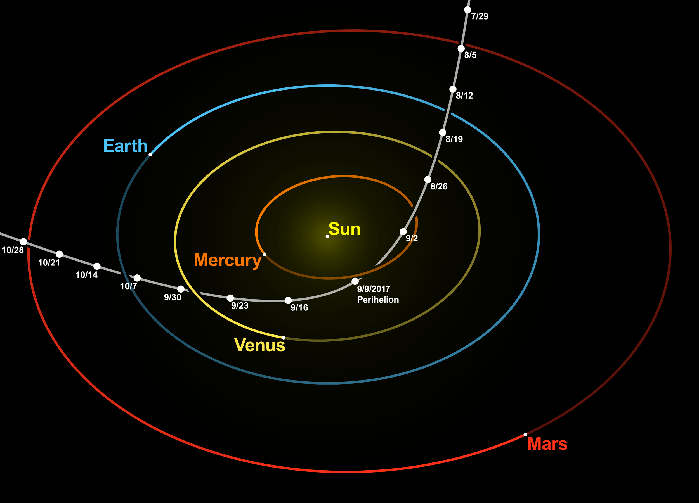

# Conic Sections

Conic sections are of particular importance to orbital mechanics since all orbits of a point mass about a much heavier body
are conic sections with the heavier body at one of the foci. This is a more general statement of
Kelper's 1st Law which states that the orbit of a planet is an ellipse with the sun at one of the foci.

There are 3 (or 4) types of conic sections: circles, ellipses, parabolas and hyperbolas. (A circle can be considered a special ellipse)
Although this is covered in year 4 math, we will go into conic section with much more detail here.

{ width="480"}
{ width="480"}

Circles were covered in primary school so we will skip that.

## Ellipse

An ellipse is a plane curve surrounding two focal points, such that for all points on the curve, the sum of the two
distances to the focal points is a constant. As such, it generalizes a circle, which is the special type of ellipse in
which the two focal points are the same. Watch the 3Blue1Brown video below more information about ellipses.

<iframe width="560" height="315" src="https://www.youtube-nocookie.com/embed/pQa_tWZmlGs" title="YouTube video player" frameborder="0" allow="accelerometer; autoplay; clipboard-write; encrypted-media; gyroscope; picture-in-picture" allowfullscreen></iframe>

{ width="480"}
{ width="480"}

### Eccentricity

We usually represent the semi-major axis as $a$, semi-minor as $b$ and linear eccentricity (length from center to foci) as $c$

{ width="480"}
{ width="480"}

As you hopefully know, for every point on the ellipse, the sum of distances to foci is constant. We can show that this is in fact just simply $2a$.

Consider the point along the $x$-axis labelled "vertex". Let's call that point $P_1$ The length of $F_1$ to $P_1$ is $a-c$, and the length of $F_2$ to $P_1$ is $a+c$. Combining these 2 gives $a+c+a-c=2a$, and this applies to **every point** on the ellipse.

Ellipses have an **eccentricity** $0\leq\varepsilon<1$, that is defined as $\varepsilon = \frac{c}{a}$, or $c=a\varepsilon$. You can think of it as the _position of the focus as a fraction of the semimajor axis_.

Now consider the sum of distances to the foci at the point labelled "co-vertex". The distance from $F_1$ (or $F_2$) to the co-vertex is $\sqrt{c^2+b^2}$. Therefore the sum of distances to the foci is $2\sqrt{c^2+b^2}$. Earlier we have proven that this value has to be $2a$, so we get the following:

$$\begin{align*}2a &= 2\sqrt{c^2+b^2} \\ a &= \sqrt{c^2+b^2} \\ a^2 &= c^2+b^2\end{align*}$$

Plugging in $c=a\varepsilon$, we can simplify to get an expression for $\varepsilon$ in terms of $a$ and $b$

$$\begin{align*}a^2 &= c^2+b^2 \\ a^2 &= a^2\varepsilon^2+b^2\\a^2-a^2\varepsilon^2 &= b^2 \\ a^2(1-\varepsilon^2) &= b^2 \\ 1-\varepsilon^2 &= \frac{b^2}{a^2} \\ 1-\frac{b^2}{a^2}&=\varepsilon^2 \\ \varepsilon&=\sqrt{1-\frac{b^2}{a^2}}\end{align*}$$

### Area

The area $A$ of an ellipse can be given by:

$$ A = \pi a b$$

!!! warning

    There is no nice formula for the perimeter of the ellipse. The reason why will give you [a world of nightmares never seen before](https://www.youtube.com/watch?v=wc9H-apkH2M).

### Aphelion and Perihelion

**Aphelion**: point in the orbit that is **furthest** away from the sun/bigger mass $r_{ap} = a(1+\varepsilon)$
**Perihelion**: point in the orbit that is **closest** to the sun/bigger mass $r_{pe} = a(1-\varepsilon)$

### Summary

| to find       | if you know        | use                                                 |
| ------------- | ------------------ | --------------------------------------------------- |
| $r_{ap}$      | $a$, $\varepsilon$ | $r_{ap} = a(1+\varepsilon)$                         |
| $r_{pe}$      | $a$, $\varepsilon$ | $r_{pe} = a(1-\varepsilon)$                         |
| $a$           | $r_{ap}$, $r_{pe}$ | $2a = r_{ap}+r_{pe}$                                |
| $a$           | $\varepsilon$, $b$ | $a = \frac{b}{\sqrt{1-\varepsilon^2}}$              |
| $b$           | $\varepsilon$, $a$ | $b = a\sqrt{1-\varepsilon^2}$                       |
| $c$           | $a$, $\varepsilon$ | $f = a\varepsilon$                                  |
| $c$           | $a$, $b$           | $c = \sqrt{a^2-b^2}$                                |
| $c$           | $r_{ap}$, $r_{pe}$ | $2c = r_{ap}-r_{pe}$                                |
| $\varepsilon$ | $a$, $b$           | $\varepsilon = \sqrt{1-\frac{b^2}{a^2}}$            |
| $\varepsilon$ | $a$, $c$           | $\varepsilon = \frac{c}{a}$                         |
| $\varepsilon$ | $r_{ap}$, $r_{pe}$ | $\varepsilon = \frac{r_{ap}-r_{pe}}{r_{ap}+r_{pe}}$ |

### Extension: semi-latus rectum

Although this is denoted as $p$ in the diagram, it is usually denoted as $\ell$. To get it's formula, first image a right triangle, with sides $p$, the line from $F_1$ to $F_2$ and the line from $F_1$ to the tip of $p$ where it intersects the ellipse.

$$\begin{align*}(2a-\ell)^2 &= (2c)^2+\ell^2 \\ (2a-\ell)^2 &= (2a\varepsilon)^2+\ell^2 \\ 4a^2-4a\ell +\ell^2 &= 4a^2\varepsilon^2+\ell^2 \\ 4a^2-4a\ell &= 4a^2\varepsilon^2 \\ 4a^2 + 4a^2\varepsilon^2  &= 4a\ell \\ \ell &= a(1-\varepsilon^2)\end{align*}$$

## Parabola, Hyperbola

These also describe paths of objects in space that will never come back, for example Oumuamua follows a hyperbolic orbit:

!!! note

    Every single "orbit" a mass can take _is a conic section_ (approximately).
    The reason why this happens will (hopefully) be covered in a later section.
    This is approximate as this assume the second mass does not move, and that the orbiting mass is a point mass.
