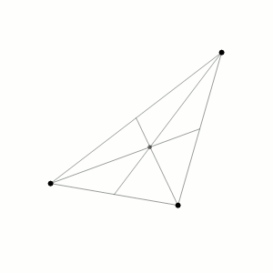
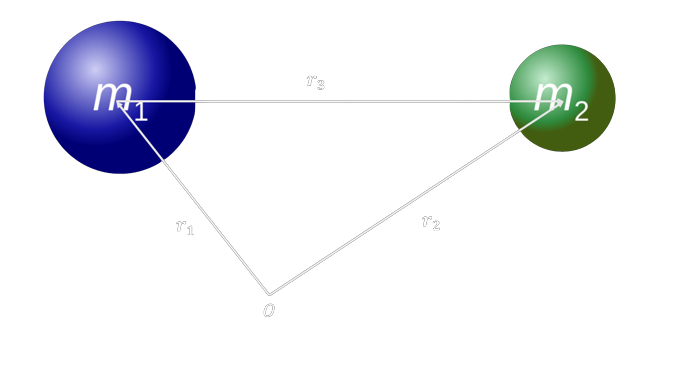

# Equation of Motion

We will take a look at systems with only 2 bodies, since this is the maximum number of bodies for which a known analytic solution is possible. Even just for 3 bodies with equal mass, we do not have an analytical solution.

> This is merely a numerical simulation. I think you can somewhat see why it is not an easy task

Let the 2 masses be $m_1$ and $m_2$ and we define 2 radius vectors, $r_1$ and $r_2$ from the origin to the masses. We denote the relative vector $r_2 - r_1$ as $r$, as shown below.

> Note that the origin $O$ is arbitrary

The force $F$ experienced by the masses can be written as such from Newton's law of universal gravitation.

$$\textbf{F}=-\frac{G m_1 m_2}{r^2} \frac{\textbf{r}}{r}$$

$$\textbf{F}=-G m_1 m_2 \frac{\textbf{r}}{r^3}$$

From Newton's 2nd Law, the force on the second mass can be expressed as:

$$\textbf{F}=m_2 \ddot{\textbf{r}}_2$$

Combining both equations gives us the **equation of motion** of $m_2$:

$$m_2 \ddot{\textbf{r}}_2=-G m_1 m_2 \frac{\textbf{r}}{r^3}$$

Applying similar technique, we can write the equation of motion for $m_1$:

$$m_1 \ddot{\textbf{r}}_1=G m_1 m_2 \frac{\textbf{r}}{r^3}$$

!!! Note

    We have flipped the sign of gravitational force for $m_1$ since the force is opposite in direction to $m_2$.

We however, are interested in the _relative_ motion. To find the equation of motion for the relative orbit, we must first cancel out the masses on both sides of the equation from both equations of motion to obtain the follwing equations:

$$
\begin{align*}
\ddot{\textbf{r}}_2&=-G m_1 \frac{\textbf{r}}{r^3}\\
\ddot{\textbf{r}}_1&=G m_2 \frac{\textbf{r}}{r^3}
\end{align*}
$$

We then subtract the equation of motion of the second mass from the first, just like how we obtain our relative radial vector:

$$
\begin{align*}
\ddot{\textbf{r}}_2-\ddot{\textbf{r}}_1&=-G m_1 \frac{\textbf{r}}{r^3}-G m_2 \frac{\textbf{r}}{r^3}\ddot{\textbf{r}}_1&=G m_2 \frac{\textbf{r}}{r^3}\\
\ddot{\textbf{r}}&=-G \frac{\textbf{r}}{r^3} (m_1 + m_2)\\
\ddot{\textbf{r}}&=-G (m_1 + m_2) \frac{\textbf{r}}{r^3}
\end{align*}
$$

For convenience, astronomers use the _standard gravitational parameter_ $\mu = G (m_1+m_2)$, so our equation of motion can be written with one less symbol:

$$\ddot{\textbf{r}}=-\mu \frac{\textbf{r}}{r^3}$$

!!! Note

    $\mu$ is an arbitrary convention because people are lazy and is not of much physical significance.

Now solving for this equation of motion will give us the relative radial vector $r$.
