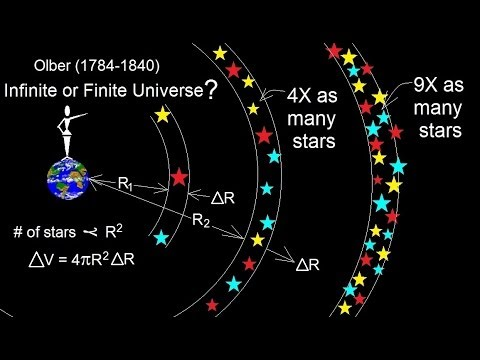

# Olber's paradox

## The Paradox

If we have a static and infinitely old universe with stars distributed homogenously, the night sky will be bright.

Intuitively, when we look to any direction, our line of sight will eventually reach the surface of a star. Since surface brightness is unchanged with distance, all of the night sky would have the same brightness as a star.

<figure markdown>
  { width="450" }
  <figcaption>Every line of sight will end on a star</figcaption>
</figure>

## Quantification

We can quantify this result by defining a function $f(r)$, the fraction of our sight that is blocked by stars when viewing to a distance r. We also set a $\rho$, the amount of stars in a unit volume in the universe (number density). Assume all stars have similar radii of length $l$.

Imagine looking out to a thin layer of a sphere centered around you with a radius $r$ and a thickness $dr$. The amount of stars in this layer would be $4 \pi r^2 dr \rho$.

The area blocked by the stars would be $4 \pi r^2 dr \rho (\pi l^2)$. Of course, some of these stars are blocked by others in layers with a smaller radius, so more helpful would be how much $f(r)$ increases with each step $dr$:

$$\begin{align*}df(r)&= (\text{unblocked})\times (\text{fraction})\\
&=(1-f(r))\left(\frac{4 \pi r^2 dr \rho (\pi l^2)}{4 \pi r^2}\right)\\
&=(1-f(r))(\pi l^2 \rho dr)\end{align*}$$

We get this differential equation:

$$\frac{df}{dr} = (1-f)\pi l^2 \rho$$

Solving:

$$\int_{0}^{f}\frac{df}{1-f} = \int_{0}^{r}\pi l^2 \rho dr$$

$$[-\ln |f-1|]^f_0=[\pi l^2 \rho r]^r_0$$

$$|f-1|=e^{-\pi l^2 \rho r}$$

$$f=1-e^{-\pi l^2 \rho r} (\because 0 \leq f \leq 1)$$

As we can see, as $r$ tends to infinity, the fraction covered will tend to 1. This affirms the fact that the infinite sky will have all lines of sight intercepting a star's surface, and the sky would look like a giant star.

!!! Question

    === "Infinitely Bright"

        Using the same setup as above, but now treating the stars as point sources with luminosity $L$, find the flux received by an observer looking out to all stars with a distance less than a radius $r$, and find this as $r$ tends to $\infty$.

    === "Solution"

        We can use our layer method again: there are $4 \pi r^2 dr \rho$ stars in a layer at radius $r$, with luminosity $4 \pi r^2 dr \rho L$.
        
        Since this layer is at a constant $r$ from the observer, the flux is:

        $$\frac{4 \pi r^2 dr \rho L}{4 \pi r^2} = L \rho dr$$

        Integrating this:

        $$\int_{0}^{r}L \rho dr = L \rho r$$

        It should seem fairly obvious by now, but:

        $$\int_{0}^{\infty}L \rho dr = \infty$$

        And we get an infinite flux at the observer. Note that in the example above about the line-of-sight, nothing is said about the flux, so this is not at odds with the previous example (although it is at odds with common sense).

Of course, by simple observation, our night sky does not look like that, as we are able to sleep comfortably and even exist at all. How would we resolve this?

## Resolution

There are a couple of legit and scam resolutions to Olber's paradox. Let's start with the scam ones:

### Obscuring gas

Perhaps there is some cold gas that's uniform throughout that blocks out very distant starlight; this may ensure that the further stars are dim enough to not affect our night.

The dust should block out the entire surface brightness of those faraway stars, and would be able to blot out our own sun, at least to a measurable extent.

Besides, this gas/matter will receive enough energy flux to heat up and emit light on their own, considerable to stars, and does not help to resolve the problem.

### Legit

To resolve this paradox, we look back at our assumptions: a static, infinite and infinitely old universe. This leaves 3 solutions:

1. The universe is not static.
2. The universe is not infinite.
3. The universe is not eternal.

As it turns out, our universe is a mix of 1 and 3, and possibly 2 as well.

Note that if, say, a very bright event occured throughout the universe at some point in the past, like widespread nuclear fusion, some of the light would still be reaching us and we would still see a bright night. It is only with the modification of light during its travel that the event's light is no longer visible.

As it turns out, such an event did indeed happen, and whose light, which was once visible, was altered to only be detectable with special equipment which are not our eyes. More on this later!
