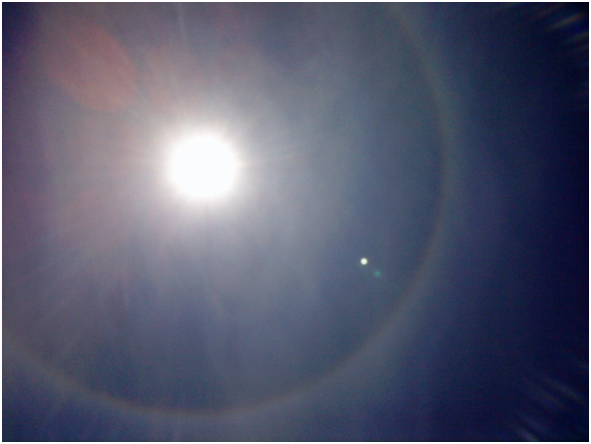
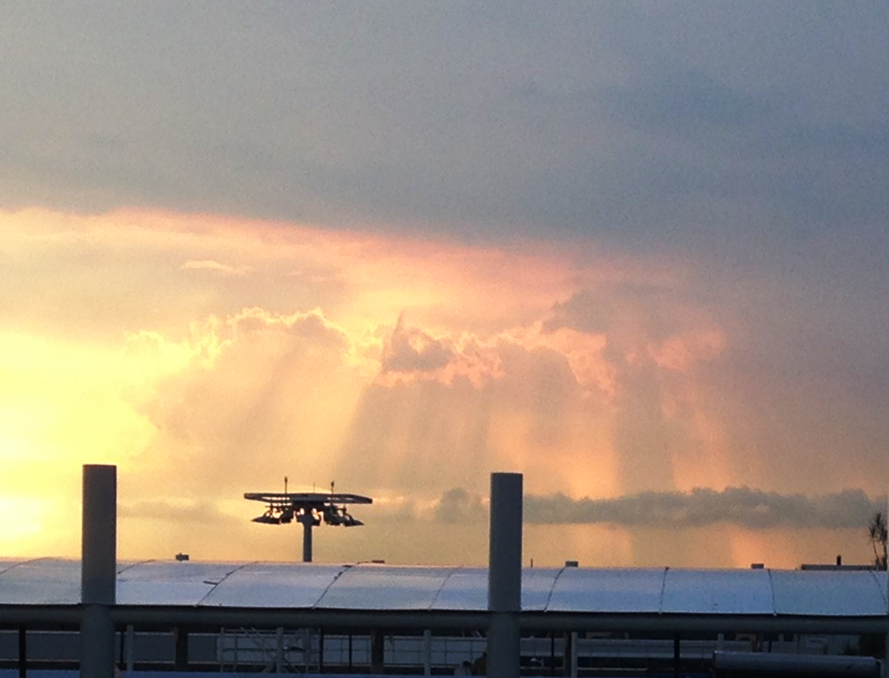

# Optical Effects

## Rainbows

Rainbows result from an optical illusion caused by millions of water droplets acting like tiny prisms.
Each component colour of visible light travels at a different rate in the water droplets, and refracts (bends) at different angles.
The water droplets split sunlight into the seven colour components and reflect them to the viewer’s eye.

A rainbow appears as an arch stretching to the sky, as the water droplets lie above the observer’s level of sight.
From a high viewpoint such as an aircraft, it is possible to see a complete circular rainbow formed by raindrops both above and below the observer’s level of sight.

## Haloes

Haloes are faint, colored rings around the sun that form due to refraction of light through ice crystals in High-Level clouds

## Iridescent clouds

Iridescent clouds form when a humid layer of air above a cumulus cloud is pushed upwards by the cloud growing and rising.
When the atmosphere is stable, air that is lifted expands and cools, and the water vapour in it condenses into droplets, resulting in a thin layer cloud known as a cap/scarf cloud (pileus).
Bright colours are sometimes observed surrounding cap clouds, due to diffracted sunlight

{width="480px"}

## Crepuscular rays and Anti-crepuscular rays

Crepuscular rays are parallel shafts or pillars of light that pierce through gaps in the cloud layer, extending like beams radiating from a point in the sky (or converging toward the Sun).

In some cases, the crepuscular rays may extend across the sky and appear to radiate to a point on the horizon opposite the Sun. These rays are known as Anti-crepuscular rays, and are less commonly seen than crepuscular rays.

Both phenomena usually occur at sunrise or sunset, when the sun is partially obscured, and are visible because of scattering of light by small water droplets or particles in the atmosphere.
While the radiating shafts of light of both optical phenomena are parallel, their appearance of converging toward or at a point is caused by perspective, the same optical illusion of looking at a long straight road or railway track converging at a point in the distance.

