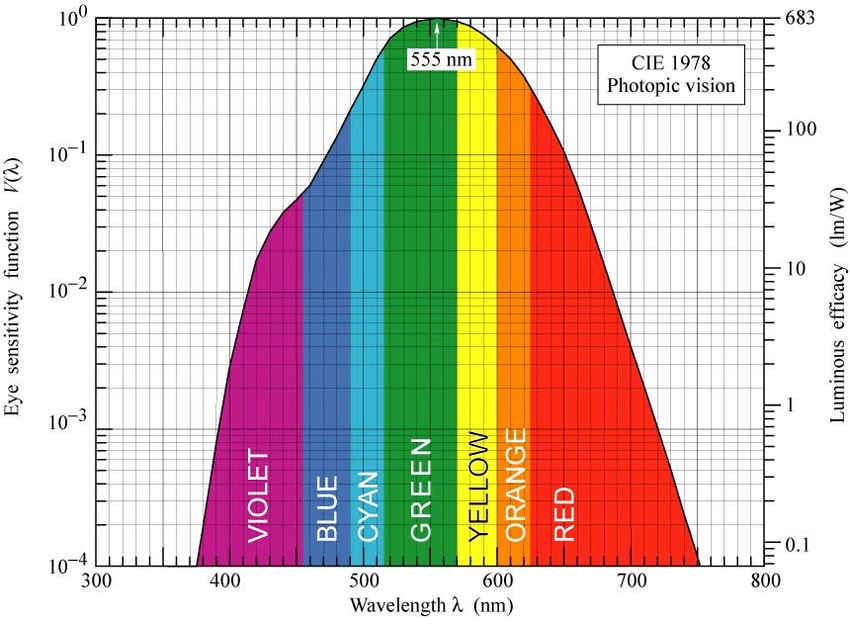

# Magnitude Systems

The _apparent magnitude_ $m$ we just defined depends on the instrument we use to measure it.
Some detectors may be more sensitive at some wavelengths and less sensitive at others.
Also, different instruments detect different wavelength ranges.
Thus the flux measured by the instrument equals not the total flux, but only a fraction of it.

Depending on how we observe an object, we can define different _magnitude systems_, each with a different $F_0$.

## Visual Magnitude

In daylight the human eye is most sensitive to radiation with a wavelength of about 550 nm, the sensitivity decreasing towards red(longer wavelengths) and violet (shorter wavelengths).
The magnitude corresponding to the sensitivity of the eye is called the _visual magnitude_ $m_v$

## Bolometric Magnitude

If, in ideal case, we were able to measure the radiation at all wavelengths, we would get the bolometric magnitude $m_{bol}$.

However, this in practice is very difficult, because part of the radiation is absorbed by the atmosphere, and that different wavelengths require different detectors.

The bolometric magnitude can be derived from the visual magnitude if we know the _bolometric correction_ $\text{BC}$:

$$
m_{bol} = m_v − \text{BC}
$$

!!! Note

    Sometimes $m_{bol}$ is defined as:

    $$
    m_{bol} = m_v + \text{BC}
    $$

    in which case $\text{BC}\leq0$

    However, since $m_{bol}\leq m_v$, we can easily tell if we made an error.

By definition, $\text{BC} = 0$ for stars of spectral class F5.

The more the radiation distribution differs from a F5 star, the higher $\text{BC}$ becomes. $\text{BC}>0$ for stars both hotter and cooler than F5 stars.

!!! Warning

    Although $m_v$ and $m_{bol}$ can be equal, the flux density corresponding to the bolometric magnitude must always be higher.

    Flux density must always be higher because $F_{bol}$ accounts for the **entire range of wavelengths** while $F_v$ only uses wavelengths at a certain band.

    The reason for this "contradiction" is because the $F_0$ for $m_{bol}$ is different from the $F_0$ for $m_v$.

!!! Note "Absolute Bolometric Magnitude"

    The absolute bolometric magnitude can be expressed in terms of the luminosity (since it's a standardized distance from the star).
    Let the total flux density at a distance r = 10 pc be $F$ and let $F_\odot$ be the equivalent quantity for the Sun.
    Since the luminosity is $L = 4\pi r2F$, we get:

    $$
    \begin{align*}
    M_{bol} - M_{bol, \odot} &= -2.5\log\left(\frac{F}{F_\odot}\right)\\
    &= -2.5\log\left(\frac{\frac{L}{4\pi r^2}}{\frac{L_\odot}{4\pi r^2}}\right)\\
    &= -2.5\log\left(\frac{L}{L_\odot}\right)
    \end{align*}$$

    The absolute bolometric magnitude $M_{bol} = 0$ corresponds to a luminosity $L_0 = 3.0 × 10^{28} \text W$

## Filters and the UBV system

One of the most widely-used multicolor magnitude systems is the UBV system, which uses three filters (U = Ultraviolet, B = Blue, V = Visual).

!!! Note "There are many color systems"

    They later also added the R (Red) and I (Infrared) bands to the UBV system (making it UBVRI), though those are less frequently seen.
    There are also many more _broad band_ systems there are less frequently seen.

    In addition to _broad band_ systems, there are also _narrow band_ systems, like Strömgren’s four-colour _uvby_ system where the bands are much narrower.
    _uvby_ is less commonly used than UBV though, and at the end of the day we don't have to worry about the specific intricacies of each system.

Usually filters are used to allow only a certain wavelength band to enter the detector, in order to detect each color in a mutlicolor magnitude system.

!!! Note "U B V"

    The magnitudes of the U, B and V bands can be written as $m_U$, $m_B$ and $m_V$.

    However it is more frequently written as just $U$, $V$ and $B$.

    Do note that $U$, $B$, and $V$ mean *apparent magnitude*, not *absolute magnitude*.

    The corresponding absolute magnitudes are $M_U$, $M_B$ and $M_V$

!!! Warning

    Generally when we refer to *magnitude*, without specifying the band, it means *visual magnitude*.

## Color indices

In any multicolor magnitude system, we can define a _color index_, which is just the difference between 2 magnitudes.
For example by subtracting the $B$ magnitude from $U$ we get the colour index $U − B$, and we can make things is $U - V$, $B - V$, etc...

??? Question

    === "Question"

        If an object is observed to have $U - B = 1.00$ and $U - V = -0.25$, find the $B - V$ color index

    === "Solution"

        $$
        \begin{align*}
        B - V &= -(U - B) + (U - V) \\
        &= -(1.00) + (-0.25) \\
        &= -1.25
        \end{align*}
        $$

The constants $F_0$ for $U$, $B$ and $V$ magnitudes are selected such that $B-V = U-B = 0$ for stars of spectral type A0 ($T_{surface} = 10 000 \text K$)

!!! Example

    Vega ($\alpha \, \text{Lyr}$, A0V) has

    - $V = 0.04$ (approx 0)
    - $B-V = 0.00$
    - $U-B = 0.00$

    **Note that Vega is (was) the standard zero magnitude star for UBV**

    The Sun has

    - $V = -26.8$
    - $B-V = 0.64$
    - $U-B = 0.12$
