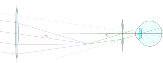

# Refractor

A refractor telescope is a type of optical telescope that uses a lens as its objective to form an image. Refracting telescopes typically have a lens at the front, then a long tube, then an eyepiece or instrumentation at the rear, where the telescope view comes to focus.

!!! Note "A bit of history"

    These were the earliest kind of telescopes. In 1608, a guy named Hans Lippershey tried to patent one and failed. Galileo Galilei heard of this "failure", made one of his own, discovered a couple of things and then was sentenced to prison.

## Galilean refractors

These use a convergent (plano-convex) objective lens and a divergent (plano-concave) eyepiece lens. It works because the objective lens is able to gather more light and focus it, more than what the human eye alone could do.

It results in a _non-inverted and upright_ image.

!!! success ""

    Good enough for Galileo to see craters on the Moon, four largest moons of Jupiter and the phases of Venus.

!!! failure ""

    Images produced are blurry and distorted.

## Keplerian refractors

The Keplerian telescope, invented by Johannes Kepler in 1611, is an improvement on Galileo's design. It uses a **convex** lens as the eyepiece instead of Galileo's **concave** one.

!!! success ""

    Rays of light emerging from the eyepiece are converging - much wider field of view and greater eye relief

    Considerably higher magnifications can be reached with this design

!!! failure ""

    Image is inverted (but no one cares about that if we can see the thing)

    aberrations still an issue - only way to overcome is with larger focal length

So a man called Johannes Hevelius thought, why don't we just make the telescope bigger? (I wish I was joking).

<figcaption>Why don't we just make it 46m longer?</figcaption>

## How do we "fix" this issue

So people thought, instead of making it longer and longer and longer and longer and longer and longer and longer and longer and longer and longer and longer and longer, why don't we just change the lens?

The main issues currently are Chromatic Aberration and Spherical Aberration

### Chromatic Aberration

Chromatic Aberration is when the lens does not focus all colors to the same point.

This is usually caused by the fact that the refractive index changes with the wavelength of light, a phenomenon called dispersion. (further reading: [Chromatic Aberration](https://en.wikipedia.org/wiki/Chromatic_aberration), [dispersion](<https://en.wikipedia.org/wiki/Dispersion_(optics)>))

### Spherical Aberration

This can effectively be summed up as "when the sphere go funny"

If we can reduce abberations, we would no longer needed longer telescopes, but only better lenses.

### Achromatic refractors

An **achromatic lens** is a lens created to reduce chromatic and spherical aberration.

Generally these get **two** wavelengths of light (usually red and blue) to meet in the same place.

The most common way to get red and blue wavelengths together is to get two individual lenses made from glasses with different amounts of dispersion. That way the CA of both lenses will cancel out. (This is known as an achromatic doublet)

The combination of materials used in the lens and the precise curvatures of the surfaces are also carefully calculated and optimized to reduce spherical aberration as much as possible. The result is a lens that produces sharper and more accurate images, especially at the edges of the field of view.

There are even better types of lenses like **apochromatic** and **superachromatic** lenses that can focus three or four separate colors to meet in the same place and also correct aberrations even more but no one really cares the big telescopes all are reflectors now

## Problems

While aberrations are minimized, they are still there, especially at shorter focal lengths. In very large apertures, there is also a problem of lens sagging, a result of gravity deforming glass. Since a lens can only be held in place by its edge, the center of a large lens sags due to gravity, distorting the images it produces.

There is a further problem of glass defects, small air bubbles trapped within the glass. In addition, glass is opaque to certain wavelengths, and even visible light is dimmed by reflection and absorption when it crosses the air-glass interfaces and passes through the glass itself.

So, astronomers tried making better versions, but all refractors seemed to suffer from these same issues. And so, they turned to overhauling the design, and trying out a new kind of telescope - Reflectors.

!!! failure ""

    TL;DR: Refractors use lenses to focus light, but its quite hard to get good lenses, and even harder to get good big lenses.
