# List of DSOs

Legend:

| Annotation |    Meaning    |
| :--------: | :-----------: |
|  **Bold**  | Constellation |
| _Italics_  |     Star      |

## List of Messier Objects

{width="480"}

|                                                             **Messier number**                                                              |                                       **Common name**                                        |                                                                                                                                                                **Picture**                                                                                                                                                                 |                                               **Object type**                                               |                                                                                                         **How to find**                                                                                                         |      [**Constellation**](https://en.wikipedia.org/wiki/Constellation)      | [$m$](https://en.wikipedia.org/wiki/Apparent_magnitude) |
| :-----------------------------------------------------------------------------------------------------------------------------------------: | :------------------------------------------------------------------------------------------: | :----------------------------------------------------------------------------------------------------------------------------------------------------------------------------------------------------------------------------------------------------------------------------------------------------------------------------------------: | :---------------------------------------------------------------------------------------------------------: | :-----------------------------------------------------------------------------------------------------------------------------------------------------------------------------------------------------------------------------: | :------------------------------------------------------------------------: | :-----------------------------------------------------: |
|       [**M1**](https://en.wikipedia.org/wiki/Crab_Nebula)[[17]](https://en.wikipedia.org/wiki/Messier_object#cite_note-17)       |                                        _Crab Nebula_                                         |                                                                                                                                                                                                                                       |                    [Supernova remnant](https://en.wikipedia.org/wiki/Supernova_remnant)                     |                                       Find “V” shape in **Taurus** “V” shape branches into _Elnath_ (**Auriga**) and _Tianguan_ From _Tianguan_, move 1° in the direction of _Elnath_                                        |      [Taurus](<https://en.wikipedia.org/wiki/Taurus_(constellation)>)      |                           8.4                           |
|        [**M2**](https://en.wikipedia.org/wiki/Messier_2)[[18]](https://en.wikipedia.org/wiki/Messier_object#cite_note-18)        |                                              –                                               |                                                                                                                                                                                                                                                       |                     [Globular cluster](https://en.wikipedia.org/wiki/Globular_cluster)                      |                    Find the second star on the long arm of **Aquarius** (_Sadalsuud_) Draw a line to closest leg end of **Pegasus** (_Enif_) Move 4°45’ in the direction of this line from _Sadalsuud_                    |    [Aquarius](<https://en.wikipedia.org/wiki/Aquarius_(constellation)>)    |                           6.3                           |
|        [**M3**](https://en.wikipedia.org/wiki/Messier_3)[[19]](https://en.wikipedia.org/wiki/Messier_object#cite_note-19)        |                                              –                                               |                                                                                                                                                                                                                                                                 |                     [Globular cluster](https://en.wikipedia.org/wiki/Globular_cluster)                      |                                  Find **Coma Berenices** On the side pointing to **Bootes,** extend in the direction of the line by 6°51’ Or, Approximately 12° top right of _Arcturus_                                   |       [Canes Venatici](https://en.wikipedia.org/wiki/Canes_Venatici)       |                           6.2                           |
|        [**M4**](https://en.wikipedia.org/wiki/Messier_4)[[20]](https://en.wikipedia.org/wiki/Messier_object#cite_note-20)        |                                              –                                               |                                                                                                                                                                                       |                     [Globular cluster](https://en.wikipedia.org/wiki/Globular_cluster)                      |                                                                                                        Beside _Antares_                                                                                                         |             [Scorpius](https://en.wikipedia.org/wiki/Scorpius)             |                           5.9                           |
|        [**M5**](https://en.wikipedia.org/wiki/Messier_5)[[21]](https://en.wikipedia.org/wiki/Messier_object#cite_note-21)        |                                        _Rose Cluster_                                        |                                                                                                                                                                                                                                |                     [Globular cluster](https://en.wikipedia.org/wiki/Globular_cluster)                      |                                                                          From _Arcturus,_ draw line through straight leg of **Bootes**, extend for 15°                                                                          |              [Serpens](https://en.wikipedia.org/wiki/Serpens)              |                           6.7                           |
|    [**M6**](https://en.wikipedia.org/wiki/Butterfly_Cluster)[[22]](https://en.wikipedia.org/wiki/Messier_object#cite_note-22)    |                                     _Butterfly Cluster_                                      |                                                                                                                                                                                                                                                                            |                         [Open cluster](https://en.wikipedia.org/wiki/Open_cluster)                          |                                                                    Draw a line from _Lesath_ to _Shaula_ at the tail of **Scorpius** Extend line by 4°42’                                                                    |             [Scorpius](https://en.wikipedia.org/wiki/Scorpius)             |                           4.2                           |
|     [**M7**](https://en.wikipedia.org/wiki/Ptolemy_Cluster)[[23]](https://en.wikipedia.org/wiki/Messier_object#cite_note-23)     |                                      _Ptolemy Cluster_                                       |                                                                                                                                                                                                         |                         [Open cluster](https://en.wikipedia.org/wiki/Open_cluster)                          |                                                                  From previous line drawn to find M6, go perpendicularly up by approximately the same distance                                                                  |             [Scorpius](https://en.wikipedia.org/wiki/Scorpius)             |                           3.3                           |
|      [**M8**](https://en.wikipedia.org/wiki/Lagoon_Nebula)[[24]](https://en.wikipedia.org/wiki/Messier_object#cite_note-24)      |                                       _Lagoon Nebula_                                        |                                                                                                                                                                                                                                                             |                         [Nebula](https://en.wikipedia.org/wiki/Nebula) with cluster                         |                                                                       Form an equilateral triangle with _Kaus Borealis and Polis_, M8 is on the other end                                                                       | [Sagittarius](<https://en.wikipedia.org/wiki/Sagittarius_(constellation)>) |                           6.0                           |
|        [**M9**](https://en.wikipedia.org/wiki/Messier_9)[[25]](https://en.wikipedia.org/wiki/Messier_object#cite_note-25)        |                                              –                                               |                                                                                                                                                                                                                                                             |                     [Globular cluster](https://en.wikipedia.org/wiki/Globular_cluster)                      |                                                           Find the tombstone of **Ophiuchus** Taking _Rasalhague_ to be the top, M9 is 3°37’ from the bottom left                                                            |            [Ophiuchus](https://en.wikipedia.org/wiki/Ophiuchus)            |                           8.4                           |
|       [**M10**](https://en.wikipedia.org/wiki/Messier_10)[[26]](https://en.wikipedia.org/wiki/Messier_object#cite_note-26)       |                                              –                                               |                                                                                                                                                                                                           |                     [Globular cluster](https://en.wikipedia.org/wiki/Globular_cluster)                      |                                                                                                     Middle of **Ophiuchus**                                                                                                     |            [Ophiuchus](https://en.wikipedia.org/wiki/Ophiuchus)            |                           6.4                           |
|   [**M11**](https://en.wikipedia.org/wiki/Wild_Duck_Cluster)[[27]](https://en.wikipedia.org/wiki/Messier_object#cite_note-27)    |                                     _Wild Duck Cluster_                                      |                                                                                                                                                                                                                                                                      |                         [Open cluster](https://en.wikipedia.org/wiki/Open_cluster)                          |                                Find the longest side of **Scutum** Starting from the star closest to **Aquila**, move 1°33’ along this side, M11 is slightly outside the shape of **Scutum**                                 |      [Scutum](<https://en.wikipedia.org/wiki/Scutum_(constellation)>)      |                           6.3                           |
|       [**M12**](https://en.wikipedia.org/wiki/Messier_12)[[28]](https://en.wikipedia.org/wiki/Messier_object#cite_note-28)       |                                              –                                               |                                                                                                                                                                                                                                         |                     [Globular cluster](https://en.wikipedia.org/wiki/Globular_cluster)                      |                                                                         Middle of **Ophiuchus**, towards the right of M10, side opposite of M9 and M14                                                                          |            [Ophiuchus](https://en.wikipedia.org/wiki/Ophiuchus)            |                           7.7                           |
|       [**M13**](https://en.wikipedia.org/wiki/Messier_13)[[29]](https://en.wikipedia.org/wiki/Messier_object#cite_note-29)       |                             _Great Globular Cluster in Hercules_                             |                                                                                                                                                                                                           |                     [Globular cluster](https://en.wikipedia.org/wiki/Globular_cluster)                      |                                                       Find the Trapezium of **Hercules**. On the side closer to **Corona Borealis**, M13 is at the midpoint of that side.                                                       |    [Hercules](<https://en.wikipedia.org/wiki/Hercules_(constellation)>)    |                           5.8                           |
|       [**M14**](https://en.wikipedia.org/wiki/Messier_14)[[30]](https://en.wikipedia.org/wiki/Messier_object#cite_note-30)       |                                              –                                               |                                                                                                                                                                                                                                                             |                     [Globular cluster](https://en.wikipedia.org/wiki/Globular_cluster)                      |                                                    Find side of **Ophiuchus** closer to **Sagittarius**. M14 is 7°49’ from the top end, and lies 1°37’ outside the tombstone                                                    |            [Ophiuchus](https://en.wikipedia.org/wiki/Ophiuchus)            |                           8.3                           |
|       [**M15**](https://en.wikipedia.org/wiki/Messier_15)[[31]](https://en.wikipedia.org/wiki/Messier_object#cite_note-31)       |                                              –                                               |                                                                                                                                                                                                           |                     [Globular cluster](https://en.wikipedia.org/wiki/Globular_cluster)                      | Find the corner of the square of **Pegasus** that is diagonally opposite of the corner that links to **Andromeda**. Make your way down the arm until it ends at _Enif_, draw a line from _Biham_ to _Enif_, extend by 4° to M15 |     [Pegasus](<https://en.wikipedia.org/wiki/Pegasus_(constellation)>)     |                           6.2                           |
|      [**M16**](https://en.wikipedia.org/wiki/Eagle_Nebula)[[32]](https://en.wikipedia.org/wiki/Messier_object#cite_note-32)      |                                        _Eagle Nebula_                                        |                                                                                                                                                                                                                   |                [H II region](https://en.wikipedia.org/wiki/H_II_region) nebula with cluster                 |                                                         Find side of **Scutum** closest to **Sagittarius**. Extend the side in the direction of **Ophiuchus** by 2°34’.                                                         |              [Serpens](https://en.wikipedia.org/wiki/Serpens)              |                           6.0                           |
|      [**M17**](https://en.wikipedia.org/wiki/Omega_Nebula)[[33]](https://en.wikipedia.org/wiki/Messier_object#cite_note-33)      |                         _Omega, Swan, Horseshoe, or Lobster Nebula_                          |                                                                                                                                                                          |                [H II region](https://en.wikipedia.org/wiki/H_II_region) nebula with cluster                 |                                                                           Forms an equilateral triangle with M16 and the closest star in **Scutum**.                                                                            | [Sagittarius](<https://en.wikipedia.org/wiki/Sagittarius_(constellation)>) |                           6.0                           |
|       [**M18**](https://en.wikipedia.org/wiki/Messier_18)[[34]](https://en.wikipedia.org/wiki/Messier_object#cite_note-34)       |                                              –                                               |                                                                                                                                                                                                                                                           |                         [Open cluster](https://en.wikipedia.org/wiki/Open_cluster)                          |                                                                                         Right beside M17, direction of **Sagittarius**.                                                                                         | [Sagittarius](<https://en.wikipedia.org/wiki/Sagittarius_(constellation)>) |                           7.5                           |
|       [**M19**](https://en.wikipedia.org/wiki/Messier_19)[[35]](https://en.wikipedia.org/wiki/Messier_object#cite_note-35)       |                                              –                                               |                                                                                                                                                                                                                                                  |                     [Globular cluster](https://en.wikipedia.org/wiki/Globular_cluster)                      |                                                                 Draw a line from _Sabik_ in **Ophiuchus** to _Xamidura_ in **Scorpius**. M19 is in the middle.                                                                  |            [Ophiuchus](https://en.wikipedia.org/wiki/Ophiuchus)            |                           7.5                           |
|     [**M20**](https://en.wikipedia.org/wiki/Trifid_Nebula)[[36]](https://en.wikipedia.org/wiki/Messier_object#cite_note-36)      |                                       _Trifid Nebula_                                        |                                                                                                                                                                                                                                            |                [H II region](https://en.wikipedia.org/wiki/H_II_region) nebula with cluster                 |                                                                                          Right beside M8, in the direction of _Polis_                                                                                           | [Sagittarius](<https://en.wikipedia.org/wiki/Sagittarius_(constellation)>) |                           6.3                           |
|       [**M21**](https://en.wikipedia.org/wiki/Messier_21)[[37]](https://en.wikipedia.org/wiki/Messier_object#cite_note-37)       |                                              –                                               |                                                                                                                                                                                                                                                  |                         [Open cluster](https://en.wikipedia.org/wiki/Open_cluster)                          |                                                                                          Right beside M20, in the direction of _Polis_                                                                                          | [Sagittarius](<https://en.wikipedia.org/wiki/Sagittarius_(constellation)>) |                           6.5                           |
|       [**M22**](https://en.wikipedia.org/wiki/Messier_22)[[38]](https://en.wikipedia.org/wiki/Messier_object#cite_note-38)       |                                    _Sagittarius Cluster_                                     |                                                                                                                                                                                                                                                  |                     [Globular cluster](https://en.wikipedia.org/wiki/Globular_cluster)                      |                                      Find the line connecting _Polis_ and _Kaus Borealis_. From _Kaus Borealis_, draw a perpendicular line in the direction away from M8 of length 2°30’.                                       | [Sagittarius](<https://en.wikipedia.org/wiki/Sagittarius_(constellation)>) |                           5.1                           |
|       [**M23**](https://en.wikipedia.org/wiki/Messier_23)[[39]](https://en.wikipedia.org/wiki/Messier_object#cite_note-39)       |                                              –                                               |                                                                                                                                                                                                                                                  |                         [Open cluster](https://en.wikipedia.org/wiki/Open_cluster)                          |                                                    Find the tail of **Serpens**. Take the 2 stars pointing towards **Ophiuchus** and extend in the other direction by 5°55’.                                                    | [Sagittarius](<https://en.wikipedia.org/wiki/Sagittarius_(constellation)>) |                           6.9                           |
| [**M24**](https://en.wikipedia.org/wiki/Sagittarius_Star_Cloud)[[40]](https://en.wikipedia.org/wiki/Messier_object#cite_note-40) |                                   _Sagittarius Star Cloud_                                   |                                                                                                                                                                                                                | [Milky Way](https://en.wikipedia.org/wiki/Milky_Way) [star cloud](https://en.wikipedia.org/wiki/Star_cloud) |                                                                                                     Between _Polis_ and M17                                                                                                     | [Sagittarius](<https://en.wikipedia.org/wiki/Sagittarius_(constellation)>) |                           4.6                           |
|       [**M25**](https://en.wikipedia.org/wiki/Messier_25)[[41]](https://en.wikipedia.org/wiki/Messier_object#cite_note-41)       |                                              –                                               |                                                                                                                                                                                                                                                  |                         [Open cluster](https://en.wikipedia.org/wiki/Open_cluster)                          |                            Find M18. Draw a line from M18 to the closest star in **Scutum**. Now draw another line perpendicular to that from M18 of length 3°30’ pointing towards **Sagittarius**.                             | [Sagittarius](<https://en.wikipedia.org/wiki/Sagittarius_(constellation)>) |                           4.6                           |
|       [**M26**](https://en.wikipedia.org/wiki/Messier_26)[[42]](https://en.wikipedia.org/wiki/Messier_object#cite_note-42)       |                                              –                                               |                                                                                                                                                                                                                                                  |                         [Open cluster](https://en.wikipedia.org/wiki/Open_cluster)                          |                                                                                                      Middle of **Scutum**                                                                                                       |      [Scutum](<https://en.wikipedia.org/wiki/Scutum_(constellation)>)      |                           8.0                           |
|    [**M27**](https://en.wikipedia.org/wiki/Dumbbell_Nebula)[[43]](https://en.wikipedia.org/wiki/Messier_object#cite_note-43)     |                                      _Dumbbell Nebula_                                       |                                                                                                                                                                                                                                             |                     [Planetary nebula](https://en.wikipedia.org/wiki/Planetary_nebula)                      |                                                    Starting from the midpoint of the 2 stars at the tip of the arrow of **Sagitta**, move 3° in the direction of Vulpecula.                                                     |            [Vulpecula](https://en.wikipedia.org/wiki/Vulpecula)            |                           7.5                           |
|       [**M28**](https://en.wikipedia.org/wiki/Messier_28)[[44]](https://en.wikipedia.org/wiki/Messier_object#cite_note-44)       |                                              –                                               |                                                                                                                                                                                                                                                           |                     [Globular cluster](https://en.wikipedia.org/wiki/Globular_cluster)                      |                                                             Lies on the line between _Polis_ and _Kaus Borealis_. Move 1° away from _Kaus Borealis_ along the line                                                              | [Sagittarius](<https://en.wikipedia.org/wiki/Sagittarius_(constellation)>) |                           7.7                           |
|       [**M29**](https://en.wikipedia.org/wiki/Messier_29)[[45]](https://en.wikipedia.org/wiki/Messier_object#cite_note-45)       |                                       _Cooling Tower_                                        |                                                                                                                                                                                                                                                  |                         [Open cluster](https://en.wikipedia.org/wiki/Open_cluster)                          |                                                          Find the star at the center of the cross of **Cygnus** _(Sadr)_. Move 1°37’ in the direction of **Sagitta**.                                                           |      [Cygnus](<https://en.wikipedia.org/wiki/Cygnus_(constellation)>)      |                           7.1                           |
|       [**M30**](https://en.wikipedia.org/wiki/Messier_30)[[46]](https://en.wikipedia.org/wiki/Messier_object#cite_note-46)       |                                     _Jellyfish Cluster_                                      |                                                                                                                                                                                                                                                  |                     [Globular cluster](https://en.wikipedia.org/wiki/Globular_cluster)                      |                                 Find the 2 triangles of **Capricornus**. Take the 3 stars closest to _Deneb Algedi_. Form a rectangle with the three stars, M30 is on the corner with no stars.                                 |          [Capricornus](https://en.wikipedia.org/wiki/Capricornus)          |                           7.7                           |
|    [**M31**](https://en.wikipedia.org/wiki/Andromeda_Galaxy)[[47]](https://en.wikipedia.org/wiki/Messier_object#cite_note-47)    |                                      _Andromeda Galaxy_                                      |                                                                                                                                                                            |                        [Spiral galaxy](https://en.wikipedia.org/wiki/Spiral_galaxy)                         |            Find **Andromeda**. Find _Mirach,_ the second star from _Alpheratz,_ corner star of **Pegasus**. Form a line from _Mirach_ to a star perpendicular to **Andromeda**. Extend the line 7°33’ from _Mirach_.            |   [Andromeda](<https://en.wikipedia.org/wiki/Andromeda_(constellation)>)   |                           3.4                           |
|       [**M32**](https://en.wikipedia.org/wiki/Messier_32)[[48]](https://en.wikipedia.org/wiki/Messier_object#cite_note-48)       |                                              –                                               |                                                                                                                                                                                                                                                          |              [Dwarf elliptical galaxy](https://en.wikipedia.org/wiki/Dwarf_elliptical_galaxy)               |                                                                                                           Same as M31                                                                                                           |   [Andromeda](<https://en.wikipedia.org/wiki/Andromeda_(constellation)>)   |                           8.1                           |
|   [**M33**](https://en.wikipedia.org/wiki/Triangulum_Galaxy)[[49]](https://en.wikipedia.org/wiki/Messier_object#cite_note-49)    |                                     _Triangulum Galaxy_                                      |                                                                                                                                                                                                                                                    |                        [Spiral galaxy](https://en.wikipedia.org/wiki/Spiral_galaxy)                         |                                                                       From the line drawn for M31, go 7° from _Mirach_ in the opposite direction of M31.                                                                        |           [Triangulum](https://en.wikipedia.org/wiki/Triangulum)           |                           5.7                           |
|       [**M34**](https://en.wikipedia.org/wiki/Messier_34)[[50]](https://en.wikipedia.org/wiki/Messier_object#cite_note-50)       |                                              –                                               |                                                                                                                                                                                                                                                     |                         [Open cluster](https://en.wikipedia.org/wiki/Open_cluster)                          |                                                            Form an equilateral triangle using _Algol_ and _Miram_ in Perseus. The other end of the triangle is M34.                                                             |     [Perseus](<https://en.wikipedia.org/wiki/Perseus_(constellation)>)     |                           5.5                           |
|       [**M35**](https://en.wikipedia.org/wiki/Messier_35)[[51]](https://en.wikipedia.org/wiki/Messier_object#cite_note-51)       |                                              –                                               |                                                                                                                                                                                                                                                            |                         [Open cluster](https://en.wikipedia.org/wiki/Open_cluster)                          |                 Find the twins of **Gemini**. From _Castor_ (the twin closer to **Auriga**), trace a line to the “boot”, a curve of stars towards the bottom of the constellation M35 is right above the boot.                  |      [Gemini](<https://en.wikipedia.org/wiki/Gemini_(constellation)>)      |                           5.3                           |
|       [**M36**](https://en.wikipedia.org/wiki/Messier_36)[[52]](https://en.wikipedia.org/wiki/Messier_object#cite_note-52)       |                                              –                                               |                                                                                                                                                                                                                                                                |                         [Open cluster](https://en.wikipedia.org/wiki/Open_cluster)                          |                            Form a line from _Elnath_ to _Mahasim_ in **Auriga**. Draw a perpendicular line from the midpoint of this line, extend this perpendicular line by 1°42’ into **Auriga**.                             |      [Auriga](<https://en.wikipedia.org/wiki/Auriga_(constellation)>)      |                           6.3                           |
|       [**M37**](https://en.wikipedia.org/wiki/Messier_37)[[53]](https://en.wikipedia.org/wiki/Messier_object#cite_note-53)       |                                              –                                               |                                                                                                                                                                                                                                                                |                         [Open cluster](https://en.wikipedia.org/wiki/Open_cluster)                          |                                     Form a line from _Elnath_ to _Mahasim_ in **Auriga**. Draw a perpendicular line from the midpoint of this line and extend it towards **Gemini** by 2°.                                      |      [Auriga](<https://en.wikipedia.org/wiki/Auriga_(constellation)>)      |                           6.2                           |
|       [**M38**](https://en.wikipedia.org/wiki/Messier_38)[[54]](https://en.wikipedia.org/wiki/Messier_object#cite_note-54)       |                                              –                                               |                                                                                                                                                                                                                                                  |                         [Open cluster](https://en.wikipedia.org/wiki/Open_cluster)                          |                                                                             Extend the previous perpendicular line by 3°55’ in the other direction.                                                                             |      [Auriga](<https://en.wikipedia.org/wiki/Auriga_(constellation)>)      |                           7.4                           |
|       [**M39**](https://en.wikipedia.org/wiki/Messier_39)[[55]](https://en.wikipedia.org/wiki/Messier_object#cite_note-55)       |                                              –                                               |                                                                                                                                                                                                                                                  |                         [Open cluster](https://en.wikipedia.org/wiki/Open_cluster)                          |                                                          Form a line from _Deneb_ to the star furthest away from **Cygnus** in **Lacerta**. Move 9°8’ along this line.                                                          |      [Cygnus](<https://en.wikipedia.org/wiki/Cygnus_(constellation)>)      |                           5.5                           |
|       [**M40**](https://en.wikipedia.org/wiki/Winnecke_4)[[56]](https://en.wikipedia.org/wiki/Messier_object#cite_note-56)       |                                         _Winnecke 4_                                         |                                                                                                                                                                                                                                                   |                          [Double star](https://en.wikipedia.org/wiki/Double_star)                           |                                                                       Find the Big Dipper. Form a line from _Phecda_ to _Megrez_ and extend it by 1°23’.                                                                        |           [Ursa Major](https://en.wikipedia.org/wiki/Ursa_Major)           |                           9.7                           |
|       [**M41**](https://en.wikipedia.org/wiki/Messier_41)[[57]](https://en.wikipedia.org/wiki/Messier_object#cite_note-57)       |                                              –                                               |                                                                                                                                                                                                                 |                         [Open cluster](https://en.wikipedia.org/wiki/Open_cluster)                          |                                                                                            Find **Sirius**. Go 4° towards the South.                                                                                            |          [Canis Major](https://en.wikipedia.org/wiki/Canis_Major)          |                           4.5                           |
|      [**M42**](https://en.wikipedia.org/wiki/Orion_Nebula)[[58]](https://en.wikipedia.org/wiki/Messier_object#cite_note-58)      |                                        _Orion Nebula_                                        |                                                                                                                                                                    |                       [H II region](https://en.wikipedia.org/wiki/H_II_region) nebula                       |                                                                                  Right under **Orion**’s belt. In the direction of **Rigel**.                                                                                   |       [Orion](<https://en.wikipedia.org/wiki/Orion_(constellation)>)       |                           4.0                           |
|       [**M43**](https://en.wikipedia.org/wiki/Messier_43)[[59]](https://en.wikipedia.org/wiki/Messier_object#cite_note-59)       |                                     _De Mairan's Nebula_                                     |                                                                                                                                                                                                                                    |         [H II region](https://en.wikipedia.org/wiki/H_II_region) nebula (part of the Orion Nebula)          |                                                                                                           Same as M42                                                                                                           |       [Orion](<https://en.wikipedia.org/wiki/Orion_(constellation)>)       |                           9.0                           |
|    [**M44**](https://en.wikipedia.org/wiki/Beehive_Cluster)[[60]](https://en.wikipedia.org/wiki/Messier_object#cite_note-60)     |                                      _Beehive Cluster_                                       |                                                                                                                                                                                                                |                         [Open cluster](https://en.wikipedia.org/wiki/Open_cluster)                          |                                                                             Find the center line of stars in **Cancer**. M44 is around the middle.                                                                              |      [Cancer](<https://en.wikipedia.org/wiki/Cancer_(constellation)>)      |                           3.7                           |
|        [**M45**](https://en.wikipedia.org/wiki/Pleiades)[[61]](https://en.wikipedia.org/wiki/Messier_object#cite_note-61)        |                                          _Pleiades_                                          |                                                                                                                                                                                                                              |                         [Open cluster](https://en.wikipedia.org/wiki/Open_cluster)                          |                                                                                                      Visible to naked eye                                                                                                       |      [Taurus](<https://en.wikipedia.org/wiki/Taurus_(constellation)>)      |                           1.6                           |
|       [**M46**](https://en.wikipedia.org/wiki/Messier_46)[[62]](https://en.wikipedia.org/wiki/Messier_object#cite_note-62)       |                                              –                                               |                                                                                                                                                                                                                                                                |                         [Open cluster](https://en.wikipedia.org/wiki/Open_cluster)                          |                                                      Form a line from _Sirius_ to _Muliphein_, star on the head of **Canis Major**. Continue in the same direction for 8°.                                                      |               [Puppis](https://en.wikipedia.org/wiki/Puppis)               |                           6.1                           |
|       [**M47**](https://en.wikipedia.org/wiki/Messier_47)[[63]](https://en.wikipedia.org/wiki/Messier_object#cite_note-63)       |                                              –                                               |                                                                                                                                                                                                                                                              |                         [Open cluster](https://en.wikipedia.org/wiki/Open_cluster)                          |                                                                                   Using the same line for M46, move 1° in the same direction.                                                                                   |               [Puppis](https://en.wikipedia.org/wiki/Puppis)               |                           4.2                           |
|       [**M48**](https://en.wikipedia.org/wiki/Messier_48)[[64]](https://en.wikipedia.org/wiki/Messier_object#cite_note-64)       |                                              –                                               |                                                                                                                                                                                                                                                              |                         [Open cluster](https://en.wikipedia.org/wiki/Open_cluster)                          |                                  Find the head of **Hydra**. Form a line between the 2 stars that are the furthest apart. Extend towards the direction of **Monoceros** by an additional 11°.                                   |       [Hydra](<https://en.wikipedia.org/wiki/Hydra_(constellation)>)       |                           5.5                           |
|       [**M49**](https://en.wikipedia.org/wiki/Messier_49)[[65]](https://en.wikipedia.org/wiki/Messier_object#cite_note-65)       |                                              –                                               |                                                                                                                                                                          |                    [Elliptical galaxy](https://en.wikipedia.org/wiki/Elliptical_galaxy)                     |                                                                           Find **Virgo** and **Leo**. In the region between **Virgo** and _Denebola_.                                                                           |       [Virgo](<https://en.wikipedia.org/wiki/Virgo_(constellation)>)       |                           9.4                           |
|       [**M50**](https://en.wikipedia.org/wiki/Messier_50)[[66]](https://en.wikipedia.org/wiki/Messier_object#cite_note-66)       |                                              –                                               |                                                                                                                                                                                                                                                              |                         [Open cluster](https://en.wikipedia.org/wiki/Open_cluster)                          |                                                   Form a line from _Sirius_ to the tip of the triangle head of **Canis Major**. Continue in the same direction for about 4°.                                                    |   [Monoceros](<https://en.wikipedia.org/wiki/Monoceros_(constellation)>)   |                           5.9                           |
|    [**M51**](https://en.wikipedia.org/wiki/Whirlpool_Galaxy)[[67]](https://en.wikipedia.org/wiki/Messier_object#cite_note-67)    |                                      _Whirlpool Galaxy_                                      |                                                                                                                                                                                                                                    |                        [Spiral galaxy](https://en.wikipedia.org/wiki/Spiral_galaxy)                         |                              Form a line from _Mizar_ to _Alkaid_, the two stars at the end of the handle on the Big Dipper. Turn 90° towards **Canes Venatici**. Move about 3° in that direction.                              |       [Canes Venatici](https://en.wikipedia.org/wiki/Canes_Venatici)       |                           8.4                           |
|       [**M52**](https://en.wikipedia.org/wiki/Messier_52)[[68]](https://en.wikipedia.org/wiki/Messier_object#cite_note-68)       |                                              –                                               |                                                                                                                                                                                                                             |                         [Open cluster](https://en.wikipedia.org/wiki/Open_cluster)                          |                                                          Form a line from _Shedar_ to _Caph_, 2 stars on the narrower end of **Cassiopeia**. Extend from _Caph_ by 6°.                                                          |  [Cassiopeia](<https://en.wikipedia.org/wiki/Cassiopeia_(constellation)>)  |                           5.0                           |
|       [**M53**](https://en.wikipedia.org/wiki/Messier_53)[[69]](https://en.wikipedia.org/wiki/Messier_object#cite_note-69)       |                                              –                                               |                                                                                                                                                                                                                              |                     [Globular cluster](https://en.wikipedia.org/wiki/Globular_cluster)                      |                                Find the 2 stars from the corner of **Virgo** closest to **Coma Berenices**. Form a line between them and extend by 7°30’ in the direction of **Coma Berenices**.                                |       [Coma Berenices](https://en.wikipedia.org/wiki/Coma_Berenices)       |                           8.3                           |
|       [**M54**](https://en.wikipedia.org/wiki/Messier_54)[[70]](https://en.wikipedia.org/wiki/Messier_object#cite_note-70)       |                                              –                                               |                                                                                                                                                                                                                                                    |                     [Globular cluster](https://en.wikipedia.org/wiki/Globular_cluster)                      |                                                                                          Bottom left of the teapot of **Sagittarius**.                                                                                          | [Sagittarius](<https://en.wikipedia.org/wiki/Sagittarius_(constellation)>) |                           8.4                           |
|       [**M55**](https://en.wikipedia.org/wiki/Messier_55)[[71]](https://en.wikipedia.org/wiki/Messier_object#cite_note-71)       |                                              –                                               |                                                                                                                                                                                                                                                    |                     [Globular cluster](https://en.wikipedia.org/wiki/Globular_cluster)                      |                         Form a line between the 2 stars on the side of the teapot of **Sagittarius** furthest from **Scorpius**. Extend the line by 8° in the direction of the tail of **Sagittarius**.                         | [Sagittarius](<https://en.wikipedia.org/wiki/Sagittarius_(constellation)>) |                           7.4                           |
|       [**M56**](https://en.wikipedia.org/wiki/Messier_56)[[72]](https://en.wikipedia.org/wiki/Messier_object#cite_note-72)       |                                              –                                               |                                                                                                                                                                                                                             |                     [Globular cluster](https://en.wikipedia.org/wiki/Globular_cluster)                      |                                        Form a line from the tail star of **Cygnus** to the side of **Lyra** furthest from _Vega_. M56 is 3°50’ from the tail of **Cygnus** on this line.                                        |                 [Lyra](https://en.wikipedia.org/wiki/Lyra)                 |                           8.3                           |
|      [**M57**](https://en.wikipedia.org/wiki/Ring_Nebula)[[73]](https://en.wikipedia.org/wiki/Messier_object#cite_note-73)       |                                        _Ring Nebula_                                         |                                                                                                                                                                                            |                     [Planetary nebula](https://en.wikipedia.org/wiki/Planetary_nebula)                      |                                                              Find the parallelogram of **Lyra**. M57 lies in the midpoint of the smaller side opposite of _Vega_.                                                               |                 [Lyra](https://en.wikipedia.org/wiki/Lyra)                 |                           8.8                           |
|       [**M58**](https://en.wikipedia.org/wiki/Messier_58)[[74]](https://en.wikipedia.org/wiki/Messier_object#cite_note-74)       |                                              –                                               |                                                                                                                                                                                                   |                 [Barred Spiral galaxy](https://en.wikipedia.org/wiki/Barred_Spiral_galaxy)                  |                                                                           Find **Virgo** and **Leo**. In the region between **Virgo** and _Denebola_.                                                                           |       [Virgo](<https://en.wikipedia.org/wiki/Virgo_(constellation)>)       |                          10.5                           |
|       [**M59**](https://en.wikipedia.org/wiki/Messier_59)[[75]](https://en.wikipedia.org/wiki/Messier_object#cite_note-75)       |                                              –                                               |                                                                                                                                                                    |                    [Elliptical galaxy](https://en.wikipedia.org/wiki/Elliptical_galaxy)                     |                                                                           Find **Virgo** and **Leo**. In the region between **Virgo** and _Denebola_.                                                                           |       [Virgo](<https://en.wikipedia.org/wiki/Virgo_(constellation)>)       |                          10.6                           |
|       [**M60**](https://en.wikipedia.org/wiki/Messier_60)[[76]](https://en.wikipedia.org/wiki/Messier_object#cite_note-76)       |                                              –                                               |                                                                                                                                                                          |                    [Elliptical galaxy](https://en.wikipedia.org/wiki/Elliptical_galaxy)                     |                                                                           Find **Virgo** and **Leo**. In the region between **Virgo** and _Denebola_.                                                                           |       [Virgo](<https://en.wikipedia.org/wiki/Virgo_(constellation)>)       |                           9.8                           |
|       [**M61**](https://en.wikipedia.org/wiki/Messier_61)[[77]](https://en.wikipedia.org/wiki/Messier_object#cite_note-77)       |                                              –                                               |                                                                                                                                                    |                        [Spiral galaxy](https://en.wikipedia.org/wiki/Spiral_galaxy)                         |                                                                           Find **Virgo** and **Leo**. In the region between **Virgo** and _Denebola_.                                                                           |       [Virgo](<https://en.wikipedia.org/wiki/Virgo_(constellation)>)       |                          10.2                           |
|       [**M62**](https://en.wikipedia.org/wiki/Messier_62)[[78]](https://en.wikipedia.org/wiki/Messier_object#cite_note-78)       |                                              –                                               |                                                                                                                                                                                                                                  |                     [Globular cluster](https://en.wikipedia.org/wiki/Globular_cluster)                      |                                                                                             Between **Scorpius** and **Ophiuchus**.                                                                                             |            [Ophiuchus](https://en.wikipedia.org/wiki/Ophiuchus)            |                           7.4                           |
|    [**M63**](https://en.wikipedia.org/wiki/Sunflower_Galaxy)[[79]](https://en.wikipedia.org/wiki/Messier_object#cite_note-79)    |                                      _Sunflower Galaxy_                                      |                                                                                                                                                                                                                                         |                        [Spiral galaxy](https://en.wikipedia.org/wiki/Spiral_galaxy)                         |                                                      From the side of **Coma Berenices** pointing towards the Big Dipper, extend by 14°(approximately midway to _Mirzar_)                                                       |       [Canes Venatici](https://en.wikipedia.org/wiki/Canes_Venatici)       |                           9.3                           |
|    [**M64**](https://en.wikipedia.org/wiki/Black_Eye_Galaxy)[[80]](https://en.wikipedia.org/wiki/Messier_object#cite_note-80)    |                                      _Black Eye Galaxy_                                      |                                                                                                                                                                                                           |                        [Spiral galaxy](https://en.wikipedia.org/wiki/Spiral_galaxy)                         |                                                                                            Within the square of **Coma Berenices**.                                                                                             |       [Coma Berenices](https://en.wikipedia.org/wiki/Coma_Berenices)       |                           9.4                           |
|       [**M65**](https://en.wikipedia.org/wiki/Messier_65)[[81]](https://en.wikipedia.org/wiki/Messier_object#cite_note-81)       |                                        _Leo Triplet_                                         |                                                                                                                                                                                                                                                                |                 [Barred Spiral galaxy](https://en.wikipedia.org/wiki/Barred_Spiral_galaxy)                  |                                         Form a line from _Zosma_ to _Chertan,_ the 2 stars that form the tail triangle of **Leo** with _Denebola_. Extend south by an additional 3.5°.                                          |         [Leo](<https://en.wikipedia.org/wiki/Leo_(constellation)>)         |                          10.3                           |
|       [**M66**](https://en.wikipedia.org/wiki/Messier_66)[[82]](https://en.wikipedia.org/wiki/Messier_object#cite_note-82)       |                                        _Leo Triplet_                                         |                                                                                                                                                                                            |                 [Barred Spiral galaxy](https://en.wikipedia.org/wiki/Barred_Spiral_galaxy)                  |                                                                                                           Same as M65                                                                                                           |         [Leo](<https://en.wikipedia.org/wiki/Leo_(constellation)>)         |                           8.9                           |
|       [**M67**](https://en.wikipedia.org/wiki/Messier_67)[[83]](https://en.wikipedia.org/wiki/Messier_object#cite_note-83)       |                                              –                                               |                                                                                                                                                                                                                                  |                         [Open cluster](https://en.wikipedia.org/wiki/Open_cluster)                          |                                                                    Form a line through the middle 2 stars of **Cancer**. Extend by 6°33’ towards **Hydra**.                                                                     |      [Cancer](<https://en.wikipedia.org/wiki/Cancer_(constellation)>)      |                           6.1                           |
|       [**M68**](https://en.wikipedia.org/wiki/Messier_68)[[84]](https://en.wikipedia.org/wiki/Messier_object#cite_note-84)       |                                              –                                               |                                                                                                                                                                                                                                  |                     [Globular cluster](https://en.wikipedia.org/wiki/Globular_cluster)                      |                                                                               Find **Corvus**. Extend the side furthest from **Crater** by 3°20’.                                                                               |       [Hydra](<https://en.wikipedia.org/wiki/Hydra_(constellation)>)       |                           9.7                           |
|       [**M69**](https://en.wikipedia.org/wiki/Messier_69)[[85]](https://en.wikipedia.org/wiki/Messier_object#cite_note-85)       |                                              –                                               |                                                                                                                                                                                                                                  |                     [Globular cluster](https://en.wikipedia.org/wiki/Globular_cluster)                      |                                                                                         Bottom right of the teapot of **Sagittarius**.                                                                                          | [Sagittarius](<https://en.wikipedia.org/wiki/Sagittarius_(constellation)>) |                           8.3                           |
|       [**M70**](https://en.wikipedia.org/wiki/Messier_70)[[86]](https://en.wikipedia.org/wiki/Messier_object#cite_note-86)       |                                              –                                               |                                                                                                                                                                                                                                                    |                     [Globular cluster](https://en.wikipedia.org/wiki/Globular_cluster)                      |                                                                                     Midpoint of the base of the teapot in **Sagittarius**.                                                                                      | [Sagittarius](<https://en.wikipedia.org/wiki/Sagittarius_(constellation)>) |                           9.1                           |
|       [**M71**](https://en.wikipedia.org/wiki/Messier_71)[[87]](https://en.wikipedia.org/wiki/Messier_object#cite_note-87)       |                                              –                                               |                                                                                                                                                                                                                                                    |                     [Globular cluster](https://en.wikipedia.org/wiki/Globular_cluster)                      |                                                                             Midpoint of the 2 stars that form the body of the arrow of **Sagitta**.                                                                             |              [Sagitta](https://en.wikipedia.org/wiki/Sagitta)              |                           6.1                           |
|       [**M72**](https://en.wikipedia.org/wiki/Messier_72)[[88]](https://en.wikipedia.org/wiki/Messier_object#cite_note-88)       |                                              –                                               |                                                                                                                                                                                                                                                    |                     [Globular cluster](https://en.wikipedia.org/wiki/Globular_cluster)                      |                                                 Form a line from (_Albali)_ the end star of **Aquarius**, to the middle star of **Capricornus**. Move 3°26’ from **Aquarius**.                                                  |    [Aquarius](<https://en.wikipedia.org/wiki/Aquarius_(constellation)>)    |                           9.4                           |
|       [**M73**](https://en.wikipedia.org/wiki/Messier_73)[[89]](https://en.wikipedia.org/wiki/Messier_object#cite_note-89)       |                                              –                                               |                                                                                                                                                                                                                                    |                      [Asterism](<https://en.wikipedia.org/wiki/Asterism_(astronomy)>)                       |                                                                                                         1°23’ from M72.                                                                                                         |    [Aquarius](<https://en.wikipedia.org/wiki/Aquarius_(constellation)>)    |                           9.0                           |
|       [**M74**](https://en.wikipedia.org/wiki/Messier_74)[[90]](https://en.wikipedia.org/wiki/Messier_object#cite_note-90)       | _Phantom Galaxy_[[91]](https://en.wikipedia.org/wiki/Messier_object#cite_note-91) |                                                                                                                                                                                                  |                        [Spiral galaxy](https://en.wikipedia.org/wiki/Spiral_galaxy)                         |                                                                     Extend the line between the 2 brightest stars in **Aries** by 10.5° towards **Pisces**.                                                                     |      [Pisces](<https://en.wikipedia.org/wiki/Pisces_(constellation)>)      |                          10.0                           |
|       [**M75**](https://en.wikipedia.org/wiki/Messier_75)[[92]](https://en.wikipedia.org/wiki/Messier_object#cite_note-92)       |                                              –                                               |                                                                                                                                                                                                                                                    |                     [Globular cluster](https://en.wikipedia.org/wiki/Globular_cluster)                      |                                                                                          Between **Sagittarius** and **Capricornus**.                                                                                           | [Sagittarius](<https://en.wikipedia.org/wiki/Sagittarius_(constellation)>) |                           9.2                           |
| [**M76**](https://en.wikipedia.org/wiki/Little_Dumbbell_Nebula)[[93]](https://en.wikipedia.org/wiki/Messier_object#cite_note-93) |                                   _Little Dumbbell Nebula_                                   |                                                                                                                                                     |                     [Planetary nebula](https://en.wikipedia.org/wiki/Planetary_nebula)                      |                                                                       Starting from _(Almach)_ tails star of **Andromeda,** go 9°42’ into **Cassiopeia**.                                                                       |     [Perseus](<https://en.wikipedia.org/wiki/Perseus_(constellation)>)     |                          10.1                           |
|       [**M77**](https://en.wikipedia.org/wiki/Messier_77)[[94]](https://en.wikipedia.org/wiki/Messier_object#cite_note-94)       |                                          _Cetus A_                                           |  |                        [Spiral galaxy](https://en.wikipedia.org/wiki/Spiral_galaxy)                         |                                      Find the head of **Cetus**, starting there, move down its neck by one star to _δ Ceti,_ then turn 90° and move 53’ in the direction of **Eridanus**.                                       |                [Cetus](https://en.wikipedia.org/wiki/Cetus)                |                           9.6                           |
|       [**M78**](https://en.wikipedia.org/wiki/Messier_78)[[95]](https://en.wikipedia.org/wiki/Messier_object#cite_note-95)       |                                              –                                               |                                                                                                                                                                                                                       |                       [Diffuse nebula](https://en.wikipedia.org/wiki/Diffuse_nebula)                        |                                                                               Starting from _Alnitak,_ go 2°30’ in the direction of _Betelguese_.                                                                               |       [Orion](<https://en.wikipedia.org/wiki/Orion_(constellation)>)       |                           8.3                           |
|       [**M79**](https://en.wikipedia.org/wiki/Messier_79)[[96]](https://en.wikipedia.org/wiki/Messier_object#cite_note-96)       |                                              –                                               |                                                                                                                                                                                                                                                              |                     [Globular cluster](https://en.wikipedia.org/wiki/Globular_cluster)                      |                                                              Form a line from the 2 middle stars of **Lepus**, move 3°55’ in the direction opposite of **Orion**.                                                               |       [Lepus](<https://en.wikipedia.org/wiki/Lepus_(constellation)>)       |                           8.6                           |
|       [**M80**](https://en.wikipedia.org/wiki/Messier_80)[[97]](https://en.wikipedia.org/wiki/Messier_object#cite_note-97)       |                                              –                                               |                                                                                                                       |                     [Globular cluster](https://en.wikipedia.org/wiki/Globular_cluster)                      |                                                                       Find the 3 claws of **Scorpius**. Midway between the claw closest to **Ophiuchus**.                                                                       |             [Scorpius](https://en.wikipedia.org/wiki/Scorpius)             |                           7.9                           |
|     [**M81**](https://en.wikipedia.org/wiki/Bode's_Galaxy)[[98]](https://en.wikipedia.org/wiki/Messier_object#cite_note-98)      |                                       _Bode's Galaxy_                                        |                                                                                                                                                                                                           |                        [Spiral galaxy](https://en.wikipedia.org/wiki/Spiral_galaxy)                         |                             Starting from **Draco**’s tail star, find a dim star 4°20’ in the direction of **Lynx**. Form a line between the two stars, extend by another 4° in the same direction.                             |           [Ursa Major](https://en.wikipedia.org/wiki/Ursa_Major)           |                           6.9                           |
|       [**M82**](https://en.wikipedia.org/wiki/Messier_82)[[99]](https://en.wikipedia.org/wiki/Messier_object#cite_note-99)       |                                        _Cigar Galaxy_                                        |                                                                                                                                                                                |                     [Starburst galaxy](https://en.wikipedia.org/wiki/Starburst_galaxy)                      |                                                                                                          Same as M81.                                                                                                           |           [Ursa Major](https://en.wikipedia.org/wiki/Ursa_Major)           |                           8.4                           |
|      [**M83**](https://en.wikipedia.org/wiki/Messier_83)[[100]](https://en.wikipedia.org/wiki/Messier_object#cite_note-100)      |                                  _Southern Pinwheel Galaxy_                                  |                                                                                                                                                                                |                 [Barred Spiral galaxy](https://en.wikipedia.org/wiki/Barred_Spiral_galaxy)                  |                                             Form a line from the tails star of **Hydra** to the head star of **Centaurus** _(Menkent)_. Move 8°50’ from _Menkent_ along this line.                                              |       [Hydra](<https://en.wikipedia.org/wiki/Hydra_(constellation)>)       |                           7.5                           |
|      [**M84**](https://en.wikipedia.org/wiki/Messier_84)[[101]](https://en.wikipedia.org/wiki/Messier_object#cite_note-101)      |                                              –                                               |                                                                                                                                                                          |                    [Lenticular galaxy](https://en.wikipedia.org/wiki/Lenticular_galaxy)                     |                                                                                     **Virgo** supercluster. Between **Virgo** and **Leo**.                                                                                      |       [Virgo](<https://en.wikipedia.org/wiki/Virgo_(constellation)>)       |                          10.1                           |
|      [**M85**](https://en.wikipedia.org/wiki/Messier_85)[[102]](https://en.wikipedia.org/wiki/Messier_object#cite_note-102)      |                                              –                                               |                                                                                                                                                                          |                    [Lenticular galaxy](https://en.wikipedia.org/wiki/Lenticular_galaxy)                     |                                                                                     **Virgo** supercluster. Between **Virgo** and **Leo**.                                                                                      |       [Coma Berenices](https://en.wikipedia.org/wiki/Coma_Berenices)       |                          10.0                           |
|      [**M86**](https://en.wikipedia.org/wiki/Messier_86)[[103]](https://en.wikipedia.org/wiki/Messier_object#cite_note-103)      |                                              –                                               |                                                                                                                                                                          |                    [Lenticular galaxy](https://en.wikipedia.org/wiki/Lenticular_galaxy)                     |                                                                                     **Virgo** supercluster. Between **Virgo** and **Leo**.                                                                                      |       [Virgo](<https://en.wikipedia.org/wiki/Virgo_(constellation)>)       |                           9.8                           |
|      [**M87**](https://en.wikipedia.org/wiki/Messier_87)[[104]](https://en.wikipedia.org/wiki/Messier_object#cite_note-104)      |                                          _Virgo A_                                           |                                                                                                                                                                          |                    [Elliptical galaxy](https://en.wikipedia.org/wiki/Elliptical_galaxy)                     |                                                                                     **Virgo** supercluster. Between **Virgo** and **Leo**.                                                                                      |       [Virgo](<https://en.wikipedia.org/wiki/Virgo_(constellation)>)       |                           9.6                           |
|      [**M88**](https://en.wikipedia.org/wiki/Messier_88)[[105]](https://en.wikipedia.org/wiki/Messier_object#cite_note-105)      |                                              –                                               |                                                                                                                                                                                                                                         |                        [Spiral galaxy](https://en.wikipedia.org/wiki/Spiral_galaxy)                         |                                                                                     **Virgo** supercluster. Between **Virgo** and **Leo**.                                                                                      |       [Coma Berenices](https://en.wikipedia.org/wiki/Coma_Berenices)       |                          10.4                           |
|      [**M89**](https://en.wikipedia.org/wiki/Messier_89)[[106]](https://en.wikipedia.org/wiki/Messier_object#cite_note-106)      |                                              –                                               |                                                                                                                                                    |                    [Elliptical galaxy](https://en.wikipedia.org/wiki/Elliptical_galaxy)                     |                                                                                     **Virgo** supercluster. Between **Virgo** and **Leo**.                                                                                      |       [Virgo](<https://en.wikipedia.org/wiki/Virgo_(constellation)>)       |                          10.7                           |
|      [**M90**](https://en.wikipedia.org/wiki/Messier_90)[[107]](https://en.wikipedia.org/wiki/Messier_object#cite_note-107)      |                                              –                                               |                                                                                                                                             |                        [Spiral galaxy](https://en.wikipedia.org/wiki/Spiral_galaxy)                         |                                                                                     **Virgo** supercluster. Between **Virgo** and **Leo**.                                                                                      |       [Virgo](<https://en.wikipedia.org/wiki/Virgo_(constellation)>)       |                          10.3                           |
|      [**M91**](https://en.wikipedia.org/wiki/Messier_91)[[108]](https://en.wikipedia.org/wiki/Messier_object#cite_note-108)      |                                              –                                               |                                                                                                                                                                                                                                         |                 [Barred Spiral galaxy](https://en.wikipedia.org/wiki/Barred_Spiral_galaxy)                  |                                                                                     **Virgo** supercluster. Between **Virgo** and **Leo**.                                                                                      |       [Coma Berenices](https://en.wikipedia.org/wiki/Coma_Berenices)       |                          11.0                           |
|      [**M92**](https://en.wikipedia.org/wiki/Messier_92)[[109]](https://en.wikipedia.org/wiki/Messier_object#cite_note-109)      |                                              –                                               |                                                                                                                                                                                                                              |                     [Globular cluster](https://en.wikipedia.org/wiki/Globular_cluster)                      |                                   Find the star on the trapezium of **Hercules** closest to **Lyra**. Form a line from the star to _Rastaban_ the star in **Draco** closest to the trapezium.                                   |    [Hercules](<https://en.wikipedia.org/wiki/Hercules_(constellation)>)    |                           6.3                           |
|      [**M93**](https://en.wikipedia.org/wiki/Messier_93)[[110]](https://en.wikipedia.org/wiki/Messier_object#cite_note-110)      |                                              –                                               |                                                                                                                                                                                                                                  |                         [Open cluster](https://en.wikipedia.org/wiki/Open_cluster)                          |                                                                                      1°24’ from _Azmidi,_ star at the head of **Puppis**.                                                                                       |               [Puppis](https://en.wikipedia.org/wiki/Puppis)               |                           6.0                           |
|      [**M94**](https://en.wikipedia.org/wiki/Messier_94)[[111]](https://en.wikipedia.org/wiki/Messier_object#cite_note-111)      |                                  _Croc's Eye or Cat's Eye_                                   |                                                                                                                                                                                                                       |                        [Spiral galaxy](https://en.wikipedia.org/wiki/Spiral_galaxy)                         |                                                             Find the midpoint of **Canes Venatici**. Move 1°37’ in the direction of **Ursa Major** perpendicularly.                                                             |       [Canes Venatici](https://en.wikipedia.org/wiki/Canes_Venatici)       |                           9.0                           |
|      [**M95**](https://en.wikipedia.org/wiki/Messier_95)[[112]](https://en.wikipedia.org/wiki/Messier_object#cite_note-112)      |                                              –                                               |                                                                                                                                                                          |                 [Barred Spiral galaxy](https://en.wikipedia.org/wiki/Barred_Spiral_galaxy)                  |                                            Find the midpoint of the line between _Regulus_ and _Chertan_ in **Leo**. Move 2°16’ perpendicularly in the direction away from **Leo**.                                             |         [Leo](<https://en.wikipedia.org/wiki/Leo_(constellation)>)         |                          11.4                           |
|      [**M96**](https://en.wikipedia.org/wiki/Messier_96)[[113]](https://en.wikipedia.org/wiki/Messier_object#cite_note-113)      |                                              –                                               |                                                                                                                                                                                                                 |                        [Spiral galaxy](https://en.wikipedia.org/wiki/Spiral_galaxy)                         |                                                                                                          Same as M95.                                                                                                           |         [Leo](<https://en.wikipedia.org/wiki/Leo_(constellation)>)         |                          10.1                           |
|      [**M97**](https://en.wikipedia.org/wiki/Owl_Nebula)[[114]](https://en.wikipedia.org/wiki/Messier_object#cite_note-114)      |                                         _Owl Nebula_                                         |                                                                                                                                                                                                  |                     [Planetary nebula](https://en.wikipedia.org/wiki/Planetary_nebula)                      |                     Find _Merak_ and _Phecda,_ 2 stars at the bottom of the ladle of **Ursa Major**. Starting from _Merak_, go 2°7’ towards _Phecda_. Move perpendicularly away from **Ursa Major** by 50’.                     |           [Ursa Major](https://en.wikipedia.org/wiki/Ursa_Major)           |                           9.9                           |
|      [**M98**](https://en.wikipedia.org/wiki/Messier_98)[[115]](https://en.wikipedia.org/wiki/Messier_object#cite_note-115)      |                                              –                                               |                                                                                                                                                                                                                                                              |                        [Spiral galaxy](https://en.wikipedia.org/wiki/Spiral_galaxy)                         |                                                                                     **Virgo** supercluster. Between **Virgo** and **Leo**.                                                                                      |       [Coma Berenices](https://en.wikipedia.org/wiki/Coma_Berenices)       |                          11.0                           |
|      [**M99**](https://en.wikipedia.org/wiki/Messier_99)[[116]](https://en.wikipedia.org/wiki/Messier_object#cite_note-116)      |                                              –                                               |                                                                                                                                                                                                                                                                |                        [Spiral galaxy](https://en.wikipedia.org/wiki/Spiral_galaxy)                         |                                                                                     **Virgo** supercluster. Between **Virgo** and **Leo**.                                                                                      |       [Coma Berenices](https://en.wikipedia.org/wiki/Coma_Berenices)       |                          10.4                           |
|     [**M100**](https://en.wikipedia.org/wiki/Messier_100)[[117]](https://en.wikipedia.org/wiki/Messier_object#cite_note-117)     |                                              –                                               |                                                                                                                                               |                        [Spiral galaxy](https://en.wikipedia.org/wiki/Spiral_galaxy)                         |                                                                                     **Virgo** supercluster. Between **Virgo** and **Leo**.                                                                                      |       [Coma Berenices](https://en.wikipedia.org/wiki/Coma_Berenices)       |                          10.1                           |
|   [**M101**](https://en.wikipedia.org/wiki/Pinwheel_Galaxy)[[118]](https://en.wikipedia.org/wiki/Messier_object#cite_note-118)   |                                      _Pinwheel Galaxy_                                       |                                                                                                                                                                 |                        [Spiral galaxy](https://en.wikipedia.org/wiki/Spiral_galaxy)                         |           Starting from _Mirzar_, the star at the bent of the handle of the Big Dipper. In the direction of **Hercules**, find a dim star 2°26’ away. Form a line from _Mirzar_ to this star extend by another 3°15’.           |           [Ursa Major](https://en.wikipedia.org/wiki/Ursa_Major)           |                           7.9                           |
|      [**M102**](https://en.wikipedia.org/wiki/NGC_5866)[[119]](https://en.wikipedia.org/wiki/Messier_object#cite_note-119)       |                                       _Spindle Galaxy_                                       |                                                                                                                                                                                                        |                    [Lenticular galaxy](https://en.wikipedia.org/wiki/Lenticular_galaxy)                     |                                             Find **Draco** and _Thuban_. Find another star on **Draco** right behind _Thuban_ towards **Draco’s** tail. Extend this line by 11°27’.                                             |       [Draco](<https://en.wikipedia.org/wiki/Draco_(constellation)>)       |                          10.7                           |
|     [**M103**](https://en.wikipedia.org/wiki/Messier_103)[[120]](https://en.wikipedia.org/wiki/Messier_object#cite_note-120)     |                                              –                                               |                                                                                                                                                                                                                                  |                         [Open cluster](https://en.wikipedia.org/wiki/Open_cluster)                          |                                                                                                 Between _Ruchbah_ and _Segin_.                                                                                                  |  [Cassiopeia](<https://en.wikipedia.org/wiki/Cassiopeia_(constellation)>)  |                           7.4                           |
|   [**M104**](https://en.wikipedia.org/wiki/Sombrero_Galaxy)[[121]](https://en.wikipedia.org/wiki/Messier_object#cite_note-121)   |                                      _Sombrero Galaxy_                                       |                                                                                                                                            |                        [Spiral galaxy](https://en.wikipedia.org/wiki/Spiral_galaxy)                         |                                                                                                Between **Virgo** and **Corvus**.                                                                                                |       [Virgo](<https://en.wikipedia.org/wiki/Virgo_(constellation)>)       |                           9.0                           |
|     [**M105**](https://en.wikipedia.org/wiki/Messier_105)[[122]](https://en.wikipedia.org/wiki/Messier_object#cite_note-122)     |                                              –                                               |                                                                                                                                                                 |                    [Elliptical galaxy](https://en.wikipedia.org/wiki/Elliptical_galaxy)                     |                                                                                                          Same as M95.                                                                                                           |         [Leo](<https://en.wikipedia.org/wiki/Leo_(constellation)>)         |                          10.2                           |
|     [**M106**](https://en.wikipedia.org/wiki/Messier_106)[[123]](https://en.wikipedia.org/wiki/Messier_object#cite_note-123)     |                                              –                                               |                                                                                                                                                                          |                        [Spiral galaxy](https://en.wikipedia.org/wiki/Spiral_galaxy)                         |                                                                                           Between **Canes Venatici and Ursa Major**.                                                                                            |       [Canes Venatici](https://en.wikipedia.org/wiki/Canes_Venatici)       |                           9.1                           |
|     [**M107**](https://en.wikipedia.org/wiki/Messier_107)[[124]](https://en.wikipedia.org/wiki/Messier_object#cite_note-124)     |                                              –                                               |                                                                                                                                                                                                                                  |                     [Globular cluster](https://en.wikipedia.org/wiki/Globular_cluster)                      |                                                      Starting from _Saik,_ the star in **Ophiuchus** closest to **Scorpius**, move 2°43’ in the direction of **Scorpius**.                                                      |            [Ophiuchus](https://en.wikipedia.org/wiki/Ophiuchus)            |                           8.9                           |
|     [**M108**](https://en.wikipedia.org/wiki/Messier_108)[[125]](https://en.wikipedia.org/wiki/Messier_object#cite_note-125)     |                                              –                                               |                                                                                                                                       |                 [Barred Spiral galaxy](https://en.wikipedia.org/wiki/Barred_Spiral_galaxy)                  |                    Find _Merak_ and _Phecda,_ 2 stars at the bottom of the ladle of **Ursa Major**. Starting from _Merak_, go 1°28’ towards _Phecda_. Move perpendicularly away from **Ursa Major** by 20’.                     |           [Ursa Major](https://en.wikipedia.org/wiki/Ursa_Major)           |                          10.7                           |
|     [**M109**](https://en.wikipedia.org/wiki/Messier_109)[[126]](https://en.wikipedia.org/wiki/Messier_object#cite_note-126)     |                                              –                                               |                                                                                                                                          |                 [Barred Spiral galaxy](https://en.wikipedia.org/wiki/Barred_Spiral_galaxy)                  |                                                Find _Merak_ and _Phecda,_ 2 stars at the bottom of the ladle of **Ursa Major**. Starting from _Phecda,_ extend the line by 40’.                                                 |           [Ursa Major](https://en.wikipedia.org/wiki/Ursa_Major)           |                          10.6                           |
|     [**M110**](https://en.wikipedia.org/wiki/Messier_110)[[127]](https://en.wikipedia.org/wiki/Messier_object#cite_note-127)     |                                              –                                               |                                                                                                                                                                                                                                                  |              [Dwarf elliptical galaxy](https://en.wikipedia.org/wiki/Dwarf_elliptical_galaxy)               |                                                                                                          Same as M31.                                                                                                           |   [Andromeda](<https://en.wikipedia.org/wiki/Andromeda_(constellation)>)   |                           9.0                           |

## Extra Deep Sky Objects

|              Name               |     Number      |                      Type                      |         Constellation          |                                                                                                                     How to Find It?                                                                                                                     |
| :-----------------------------: | :-------------: | :--------------------------------------------: | :----------------------------: | :-----------------------------------------------------------------------------------------------------------------------------------------------------------------------------------------------------------------------------------------------------: |
|         Double Cluster          |  NGC 884 & 869  |               Open star cluster                | Between Perseus and Cassiopeia |                                      Draw a line from _Navi_, the center star of **Cassiopeia**, to _Ruchbah_, the bottom star of the wider triangle in **Cassiopeia**, continue the line to the double clusters.                                       |
|          Helix nebula           |    NGC 7293     |                Planetary nebula                |            Aquarius            |    Start with _Fomalhaut_ in **Pisces Austrinus**, then find a faint star above it, and two faint stars below it, both forming **Pisces Austrinus**. Draw a line from the middle of the two bottom stars to the top star, continue to Helix nebula.     |
|        Sculptor’s spiral        |     NGC 253     |                     galaxy                     |            Sculptor            | Start with the arc of Aquarius that is further away from **Pisces Austrinus**, then continue down to _Diphda_ in **Cetus**, from there, move perpendicular to the direction earlier towards **Sculptor**, you should find the galaxy on your way there. |
|          Flame nebula           |    NGC 2024     |       Cluster associated with nebulosity       |             Orion              |                                                                                                        Right beside the belt star of _Alnitak_.                                                                                                         |
|    Tau Canis Majoris cluster    | C64 or NGC 2362 |                  Open cluster                  |          Canis Major           |                                                                                                                                                                                                                                                         |
|   Great barred spiral galaxy    |    NGC 1365     |              Barred spiral galaxy              |             Fornax             |                                                                                                                                                                                                                                                         |
|            Fornax A             |    NGC 1316     | Elliptical galaxy collided with another galaxy |             Fornax             |                                                                                                                                                                                                                                                         |
| False Comet, Northern Jewel Box | C76 or NGC 6231 |               Open star cluster                |            Scorpius            |                                                                                                                 Near _Zeta (ζ) Scorpii_                                                                                                                 |
|       ω Centauri Cluster        | C80 or NGC 5139 |             Globular star cluster              |           Centaurus            |                                                                                             Somewhere in between _Alnair (Baten Kentaurus)_ and _Muhlifan_                                                                                              |
|            Jewel Box            | C94 or NGC 4755 |               Open star cluster                |              Crux              |                                                                                                                  Southwest of _Mimosa_                                                                                                                  |

### M1 (Crab Nebula)

<figure markdown>
    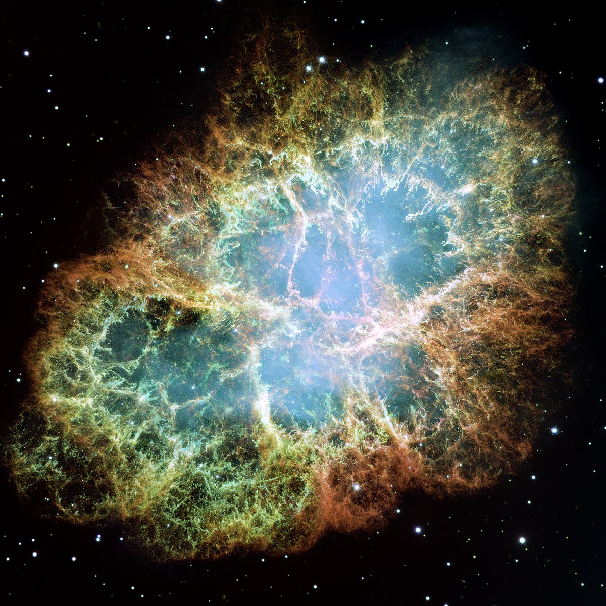{ width="480px", align=right}
    <figcaption>Messier 1, the Crab Nebula, a <a href="https://en.wikipedia.org/wiki/Supernova_remnant">Supernova remnant, that does not look like a crab at all</a></figcaption>
</figure>

!!! Success "How to find"

    Find “V” shape in **Taurus**

    “V” shape branches into _Elnath_ (**Auriga**) and _Tianguan_ From _Tianguan_, move 1° in the direction of _Elnath_

    

??? Info

    |      Property          |                   Value                      |
    | :--------------------: | :------------------------------------------: |
    |  **Right Ascension**   | 05h 34m 30s |
    |    **Declination**     |                +22° 00′ 52.2″                |
    |      **Distance**      |          6500±1600 ly (2000±500 pc)          |
    |  **Visual magnitude**  |                     8.4                      |
    | **Apparent Dimension** |                    6′x4′                     |

    > sources: [for distance](https://arxiv.org/abs/0801.1142), [for everything else](http://www.messier.seds.org/m/m001.html)

### M2

<figure markdown>
    { width="480px", align=right}
    <figcaption>Messier 2, a <a href="https://en.wikipedia.org/wiki/Globular_cluster">Globular cluster</a></figcaption>
</figure>

!!! Success "How to find"

    Find the second star on the long arm of **Aquarius** (_Sadalsuud_) Draw a line to closest leg end of **Pegasus** (_Enif_)

    Move 4°45’ in the direction of this line from _Sadalsuud_

    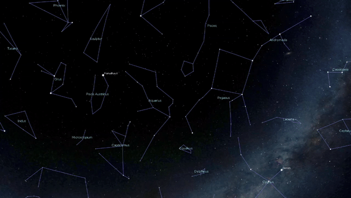

??? Info

    |        Property        |                      Value                      |
    | :--------------------: | :---------------------------------------------: |
    |  **Right Ascension**   | 21h 33m 27.02s |
    |    **Declination**     |                 -00° 49′ 23.7″                  |
    |      **Distance**      |                55000 ly (17 kpc)                |
    |  **Visual magnitude**  |                       6.5                       |
    | **Apparent Dimension** |                      16.0′                      |

    > sources: [for distance](https://arxiv.org/abs/1804.09381), [for everything else](http://www.messier.seds.org/m/m002.html)

### M3

<figure markdown>
    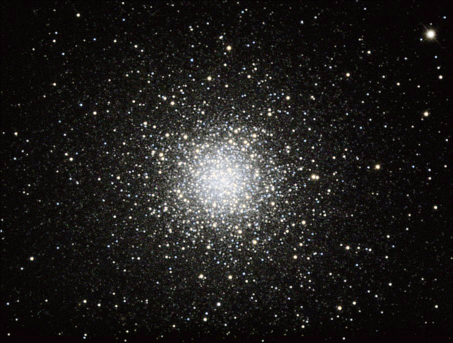{ width="480px", align=right}
    <figcaption>Messier 3, a <a href="https://en.wikipedia.org/wiki/Globular_cluster">Globular cluster</a></figcaption>
</figure>

!!! Success "How to find"

    Find **Coma Berenices**

    On the side pointing to **Bootes**, extend in the direction of the line by 6°51’

    Or, Approximately 12° top right of _Arcturus_

    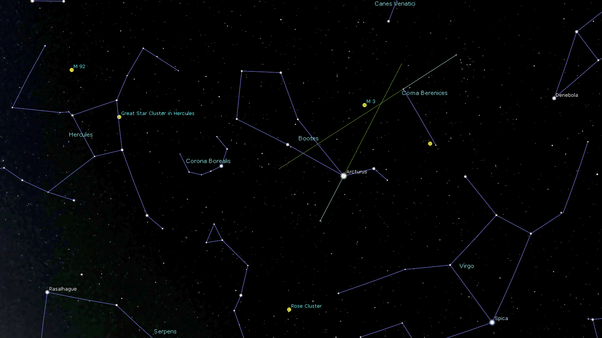

??? Info

    |        Property        |                      Value                      |
    | :--------------------: | :---------------------------------------------: |
    |  **Right Ascension**   | 13h 42m 11.62s |
    |    **Declination**     |                 +28° 22′ 38.2″                  |
    |      **Distance**      |               33.9 kly (10.4 kpc)               |
    |  **Visual magnitude**  |                       6.2                       |
    | **Apparent Dimension** |                      18.0′                      |

    > source: http://www.messier.seds.org/m/m003.html

### M4 (Crab Globular Cluster, Spider Globular Cluster)

<figure markdown>
    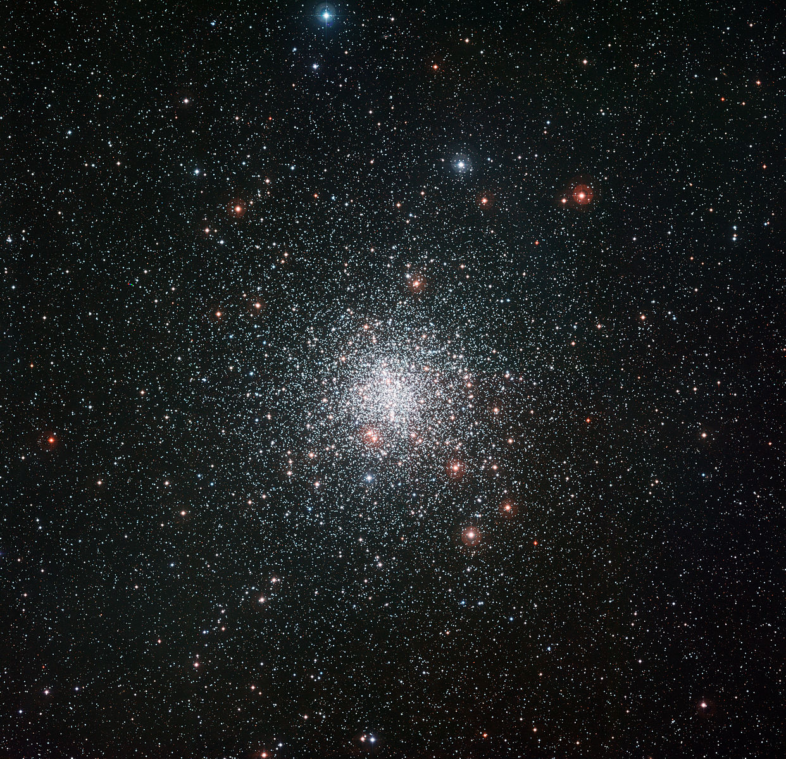{ width="480px", align=right}
    <figcaption>Messier 4 (aka Crab <a href="https://en.wikipedia.org/wiki/Globular_cluster">Globular cluster</a> or Spider <a href="https://en.wikipedia.org/wiki/Globular_cluster">Globular cluster</a>)</figcaption>
</figure>

!!! Success "How to find"

    Beside _Antares_

    

??? Info

    |        Property        |                      Value                      |
    | :--------------------: | :---------------------------------------------: |
    |  **Right Ascension**   | 16h 23m 35.22s |
    |    **Declination**     |                 -26° 31′ 32.7″                  |
    |      **Distance**      |                7.2 kly (2.2 kpc)                |
    |  **Visual magnitude**  |                       5.9                       |
    | **Apparent Dimension** |                      36.0′                      |

### M5 (Rose Cluster)

<figure markdown>
    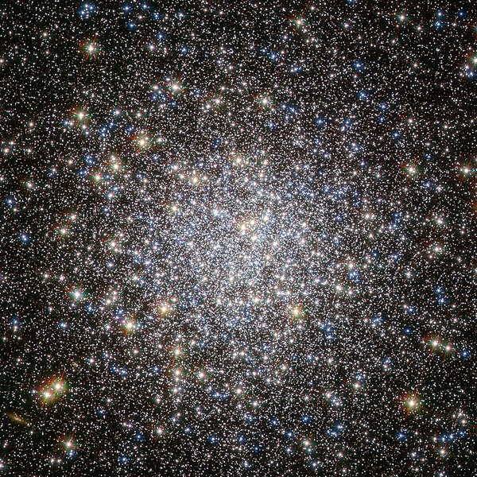{ width="480px", align=right}
    <figcaption>Messier 5, a <a href="https://en.wikipedia.org/wiki/Globular_cluster">Globular cluster</a> </figcaption>
</figure>

!!! Success "How to find"

    From _Arcturus,_ draw line through straight leg of **Bootes**, extend for 15°

    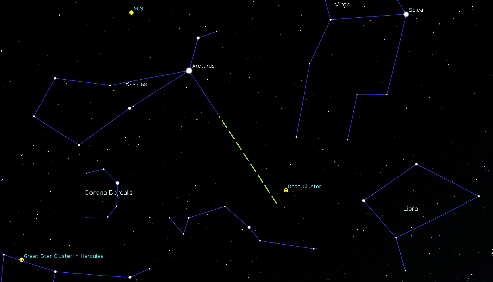

??? Info

    |        Property        |                      Value                      |
    | :--------------------: | :---------------------------------------------: |
    |  **Right Ascension**   | 15h 18m 33.22s |
    |    **Declination**     |                 +02° 04′ 51.7″                  |
    |      **Distance**      |               24.5 kly (7.5 kpc)                |
    |  **Visual magnitude**  |                      5.95                       |
    | **Apparent Dimension** |                      23.0′                      |

### M6 (Butterfly Cluster)

<figure markdown>
    { width="480px", align=right}
    <figcaption>Messier 6 (aka Butterfly Cluster), an <a href="https://en.wikipedia.org/wiki/Open_cluster">Open cluster</a> </figcaption>
</figure>

!!! Success "How to find"

    Find M7 first

    From previous line drawn to find M7, go perpendicularly up by approximately the same distance

??? Info

    |        Property        |              Value              |
    | :--------------------: | :-----------------------------: |
    |  **Right Ascension**   | 17h 40.1m |
    |    **Declination**     |            −32° 13′             |
    |      **Distance**      |      1.59 kly (0.487 kpc)       |
    |  **Visual magnitude**  |               4.2               |
    | **Apparent Dimension** |               25′               |

    > sources: [1](http://www.messier.seds.org/m/m006.html) [2](https://arxiv.org/abs/0909.3737)

### M7 (Ptolemy Cluster)

<figure markdown>
    { width="480px", align=right}
    <figcaption>Messier 7 (aka Ptolemy Cluster), an <a href="https://en.wikipedia.org/wiki/Open_cluster">Open cluster</a> </figcaption>
</figure>

!!! Success "How to find"

    Draw a line from _Lesath_ to _Shaula_ at the tail of **Scorpius**

    Extend line by 4°42’

    

??? Info

    |        Property        |                     Value                      |
    | :--------------------: | :--------------------------------------------: |
    |  **Right Ascension**   | 17h 53m 51.2s |
    |    **Declination**     |                  −34° 47′ 34″                  |
    |      **Distance**      |           980 ± 33 ly (300 ± 10 pc)            |
    |  **Visual magnitude**  |                      3.3                       |
    | **Apparent Dimension** |                     80.0′                      |

    > sources: [1](https://ned.ipac.caltech.edu/cgi-bin/nph-objsearch?objname=Messier+7) [2](https://arxiv.org/abs/0906.4330)

### M8 (Lagoon Nebula)

<figure markdown>
    { width="480px", align=right}
    <figcaption>Messier 8 (aka Lagoon Nebula), a <a href="https://en.wikipedia.org/wiki/Nebula">Nebula</a> with cluster</figcaption>
</figure>

!!! Success "How to find"

    Form an equilateral triangle with _Kaus Borealis_ and _Polis_, M8 is on the other end

??? Info

    |        Property        |                    Value                     |
    | :--------------------: | :------------------------------------------: |
    |  **Right Ascension**   | 18h 03m 27s |
    |    **Declination**     |                 −24° 23′ 12″                 |
    |      **Distance**      |              4100 ly (1250 pc)               |
    |  **Visual magnitude**  |                     6.0                      |
    | **Apparent Dimension** |                   90′x40′                    |

### M9

<figure markdown>
    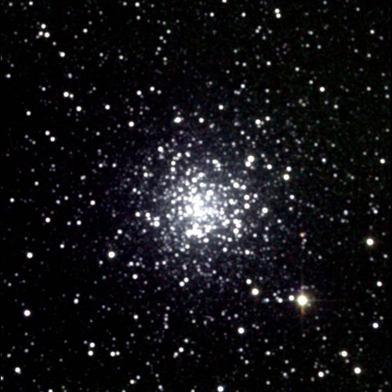{ width="480px", align=right}
    <figcaption>Messier 9, a <a href="https://en.wikipedia.org/wiki/Globular_cluster">Globular Cluster</a></figcaption>
</figure>

!!! Success "How to find"

    Find the tombstone (main 6-sided shape) of **Ophiuchus**

    Taking _Rasalhague_ to be the top, M9 is 3°37’ from the bottom left

??? Info

    |        Property        |                      Value                      |
    | :--------------------: | :---------------------------------------------: |
    |  **Right Ascension**   | 17h 19m 11.78s |
    |    **Declination**     |                 −18° 30′ 58.5″                  |
    |      **Distance**      |               25.8 kly (7.9 kpc)                |
    |  **Visual magnitude**  |                       7.7                       |
    | **Apparent Dimension** |                      9.3′                       |

### M10

<figure markdown>
    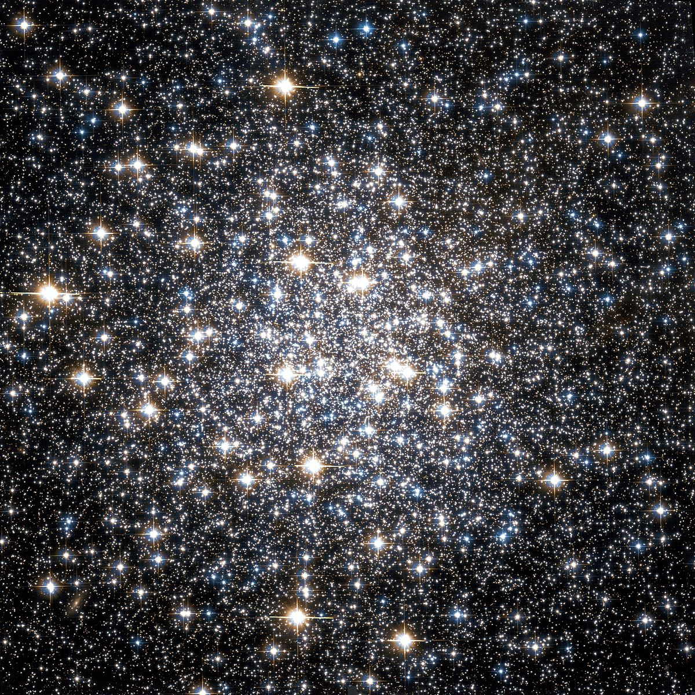{ width="480px", align=right}
    <figcaption>Messier 10, a <a href="https://en.wikipedia.org/wiki/Globular_cluster">Globular Cluster</a></figcaption>
</figure>

!!! Success "How to find"

    Middle of **Ophiucus**

??? Info

    |        Property        |                      Value                      |
    | :--------------------: | :---------------------------------------------: |
    |  **Right Ascension**   | 17h 19m 11.78s |
    |    **Declination**     |                 −18° 30′ 58.5″                  |
    |      **Distance**      |               25.8 kly (7.9 kpc)                |
    |  **Visual magnitude**  |                       7.7                       |
    | **Apparent Dimension** |                      9.3′                       |

### M11 (Wild Duck Cluster)

<figure markdown>
    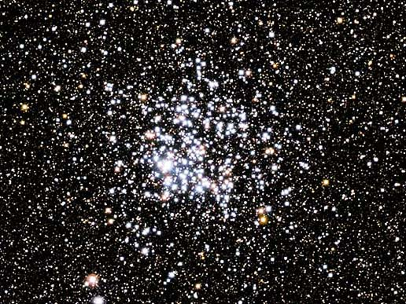{ width="480px", align=right}
    <figcaption>Messier 11 (aka Wild Duck Cluster), an <a href="https://en.wikipedia.org/wiki/Open_cluster">Open Cluster</a></figcaption>
</figure>

!!! Success "How to find"

    Find the longest side of **Scutum**

    Starting from the star closest to **Aquila**, move 1°33’ along this side, M11 is slightly outside the shape of **Scutum**

??? Info

    |        Property        |                     Value                      |
    | :--------------------: | :--------------------------------------------: |
    |  **Right Ascension**   | 18h 51m 05.0s |
    |    **Declination**     |                  −06° 16′ 12″                  |
    |      **Distance**      |               6120 ly (1877 pc)                |
    |  **Visual magnitude**  |                      5.8                       |
    | **Apparent Dimension** |                     22.8′                      |

### M12

<figure markdown>
    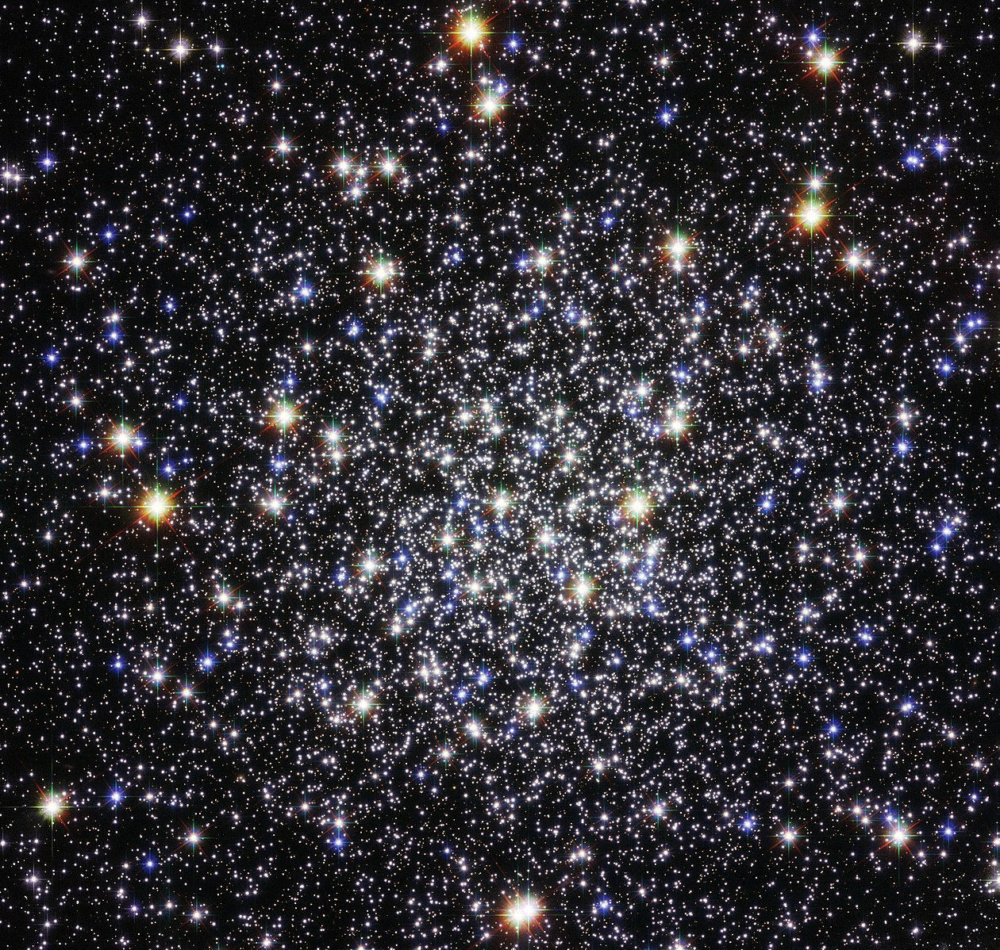{ width="480px", align=right}
    <figcaption>Messier 12, a <a href="https://en.wikipedia.org/wiki/Globular_cluster">Globular Cluster</a></figcaption>
</figure>

!!! Success "How to find"

    Middle of **Ophiuchus**, towards the right of M10, side opposite of M9 and M14

??? Info

    |        Property        |                      Value                      |
    | :--------------------: | :---------------------------------------------: |
    |  **Right Ascension**   | 16h 47m 14.18s |
    |    **Declination**     |                 −01° 56′ 54.7″                  |
    |      **Distance**      |       16.44 ± 0.16 kly (5.04 ± 0.05 kpc)        |
    |  **Visual magnitude**  |                       6.7                       |
    | **Apparent Dimension** |                      16.0′                      |

### M13

<figure markdown>
    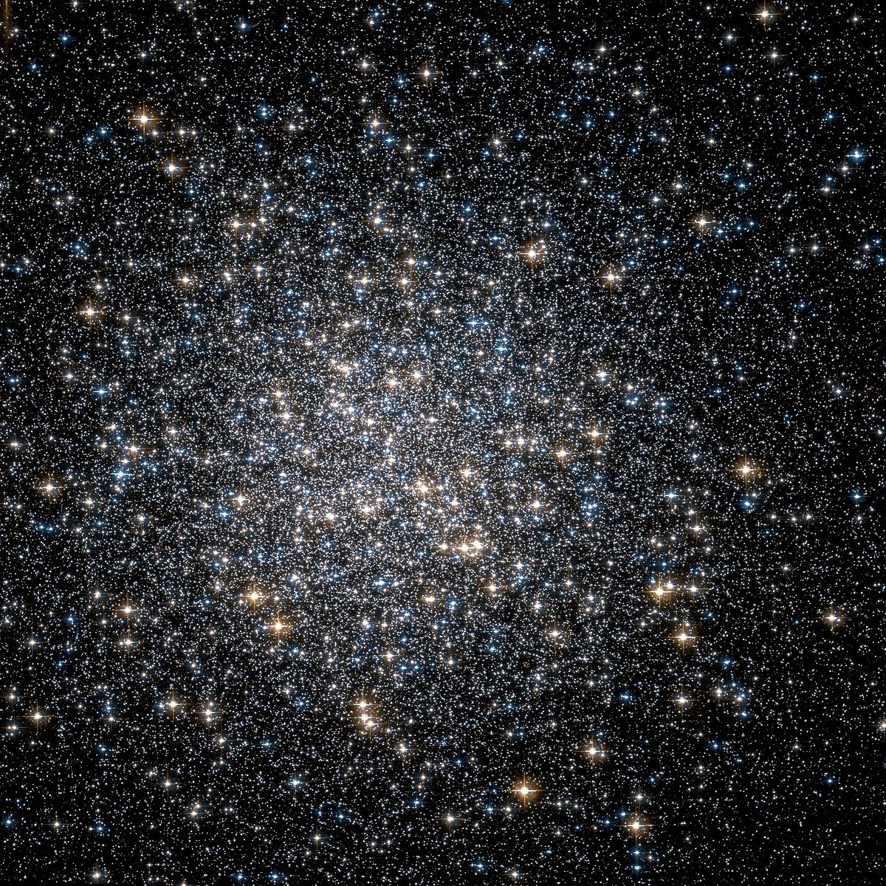{ width="480px", align=right}
    <figcaption>Messier 13, a <a href="https://en.wikipedia.org/wiki/Globular_cluster">Globular Cluster</a></figcaption>
</figure>

!!! Success "How to find"

    Middle of **Ophiuchus**, towards the right of M10, side opposite of M9 and M14

??? Info

    |        Property        |                      Value                      |
    | :--------------------: | :---------------------------------------------: |
    |  **Right Ascension**   | 16h 41m 14.24s |
    |    **Declination**     |                 +36° 27′ 35.5″                  |
    |      **Distance**      |               22.2 kly (6.8 kpc)                |
    |  **Visual magnitude**  |                       5.8                       |
    | **Apparent Dimension** |                       20′                       |
