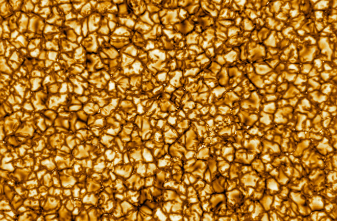

# Structure of a Star

## The Core

Recall that a star is constantly under pressure due to gravity compressing it. This means that at the centre of the star
there is a great pressure since there is more stuff compressing the core. As we all know, more pressure means that things 
get hotter. Thus, it is at the core, where the temperature of the star is the highest.

Now, we all know that nuclear fusion needs a high temperature to occur. After all, why would scientists want cold fusion
if it happened at room temperature? Given the core has the highest temperature in the entire star, it is logical that
it is the location where nuclear fusion occurs.

Now that we know how energy in the star is made. How is it produced? Let us find out.

!!! note
    The subsequent analysis of the radiative zone and convective zone is done with respect to a sun-like star. Depending on
    the mass of the star, the radiative zone can be the inside or outside layer of the star.

## The Radiative Zone

On its journey out, energy in the form of photons first enters the radiative zone. 
As the name suggests, radiation is the main form of energy transfer here – though not quite the form that you would expect!

Keeping in mind that the stars are very dense, photons don’t travel straight through. 
Rather, they travel in a zigzag manner. This zigzag motion is caused by the photons 
"bouncing" around within this dense layer. Note that this layer of plasma is so hot that it is 
fully ionized (all electrons are stripped from atoms to form nuclei), so the constituent particles 
interact strongly with light. Overall, due to the sheer density of the radiative zone, a photon takes a few million
years to reach the edge of the radiative zone from the core. This is in spite of the fact that
photons travel at the speed of light. This bouncing also gradually causes the photon to lose
energy over time, and its wavelength will decrease, causing it to fall from the gamma range to
the visible-UV range in the electromagnetic spectrum.

## The Convective Zone

{ width="240", align=right }

At this point, temperatures are sufficiently low for electrons and atomic nuclei to recombine and form
atoms. These atoms will then absorb the photons and heat up. Thus, the plasma at the bottom of the convective zone is
hotter and less dense. As a result, it rises while the cooler plasma (which is denser) sinks.

This setups up convection currents which are visible to the naked eye (see the picture of convection cells on the sun's surface). 
When the plasma reaches the surface of the star, its energy is released as heat.

## Different Mass Stars
