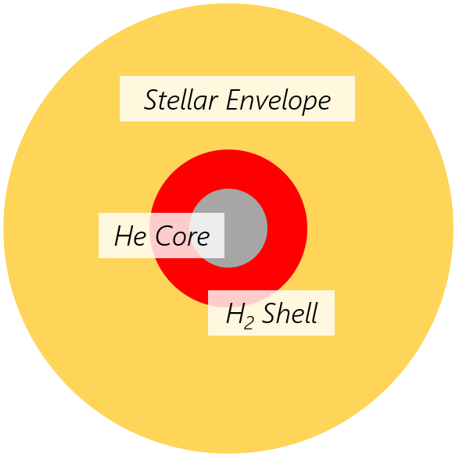
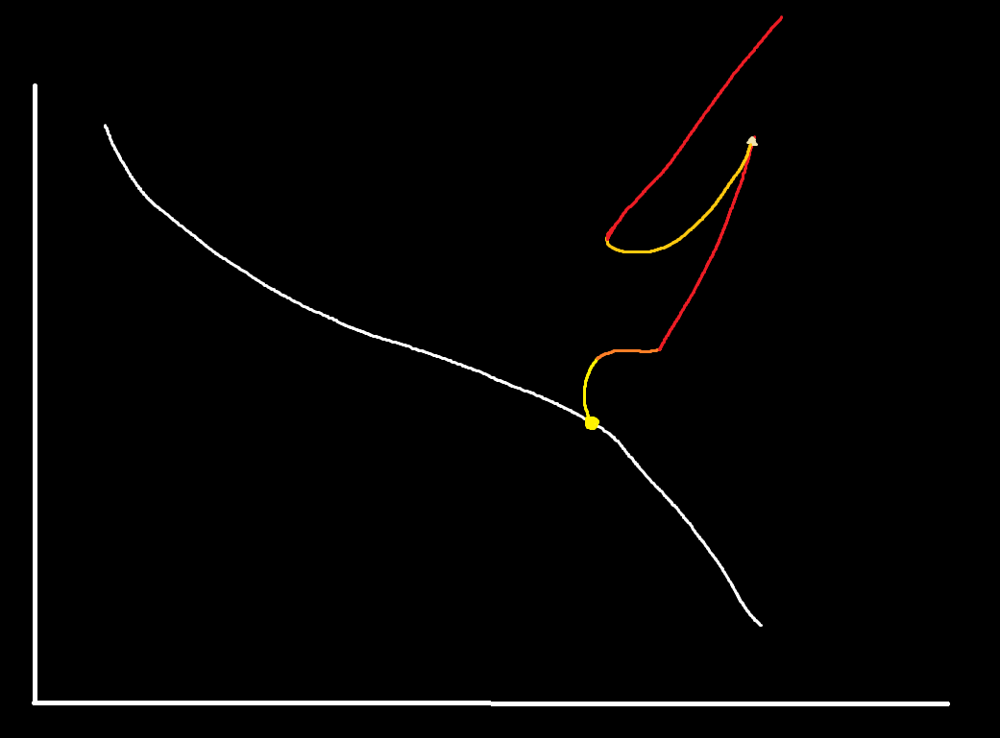

# Stellar formation

gas/dust cloud

gravity attract cloud together

protostar begings emitting light and gravity attracts a circumstellar disk

# Main sequence

about 90% of lifetime

hydrogen fusion

will get hotter and more luminous over time. As the number of hydrogen atoms per unit mass decrease, so too does their energy output provided through nuclear fusion. This results in a decrease in pressure support (radiation), which causes the core to contract in size until the increased density and temperature bring the core pressure in to equilibrium with the layers above. The higher temperature causes the remaining hydrogen to undergo fusion at a more rapid rate, thereby generating the energy needed to maintain the equilibrium, and hence becoming more luminous over time. This explains why the main sequence is a broad band rather than a narrow line as stars move up and to the right on this band as they age.

# Subgiant

Eventually the core runs out of hydrogen to fuse. It becomes _inert_ (unable to "react" via nuclear processes, i.e. fusion). Fusion stops _entirely_. There is no longer any pressure support, so gravity pulls outer layers inwards, which causes the core to contract and heat up until the area _around the core_ heats up enough to start fusing hydrogen, creating a _shell_ of hydrogen fusion. (this shell lasts 1 billion years for the sun)

> structure of a subgiant

# Red Giant Branch (RGB)

Due to the increased temperature, the hydrogen fusion rate (in the shell) is faster and radiation pressure is higher. This actually causes the outer layers of the star to expand to maintain the pressure gradient. Due to decreased pressure and increase surface area this causes the surface temperature to drop and for it to turn red.

> Stellar evolutionary track so far, Yellow - main sequence. Orange - subgiant branch

The outer envelope is so extended that it is only weakly held by gravitational force to the rest of the star and easily ejected. However the contracted helium core is incredibly dense. It is only about one-third its original size.

The core contraction and envelope expansion is very rapid, taking only a few million years. In this time the temperature of the star will cool from its main sequence value of 6,000–30,000 K to around 5,000 K. Hence there are very few stars in that area in the HR diagram

> hertzsprung gap

Hydrogen fusion in the shell produces more helium. This gets dumped onto the core, adding to its mass, causing it to heat up even more. When the core temperature reaches **100 million K**, the helium nuclei now have sufficient kinetic energy to overcome the strong coulombic repulsion and fuse together, forming carbon-12 in a two-stage process. (triple alpha process)

It first fuses 2 He-4 to Be-8. However, this is slightly endothermic, and Be-8 is highly unstable and decays back into smaller nuclei with a half-life of $8.19 \times 10^{−17}s$. Unless within that time a third alpha particle fuses with the beryllium-8 nucleus to produce an excited resonance state of carbon-12 [Holye state](https://en.wikipedia.org/wiki/Carbon-12#Hoyle_state). But even this usually goes back to 3 He-4 nuclei, but about every 1 in 2423.1 times it releases energy and changes into the stable base form of carbon-12

As a side effect of the process, some carbon nuclei fuse with additional helium to produce a stable isotope of oxygen and energy:

Once the temperature is hot enough helium fusion begins in a matter of minutes or hours. This sudden onset of helium core fusion (or "burning") is called the _helium flash_.

# Horizontal Branch (HB)

The energy released from the helium flash allows the core to cool and expand. This decreases the radiation pressure and the star contracts. This result in a hotter outer layer of the star but a smaller overall size. The rise in effective temperature and decrease in surface area are such that the luminosity remains roughly constant.

> structure of a sun-like star on the horizontal branch

> Stellar evolutionary track so far, Red - RGB. Orange-Yellow: HB

Our sun has sufficient helium fuel for this stage to last for about 100 million years

fun fact: more stars less massive than $2M_\odot$, the helium cores have the same mass when helium fusion starts, regardless of total solar mass. So the helium fusion luminosity on the horizontal branch is the same (Hydrogen shell fusion causes total luminosity to vary, but for most stars they are very similar)

# Asymptotic Giant Branch (AGB)

Eventually all the helium in the core has fused into carbon and oxygen and so the core becomes inert again and contracts. Carbon and oxygen nuclei have more protons in them than helium does so the repulsion is greater, and require higher temperature and pressure. (Carbon burning, the next available fusion process, occurs at 500-900 million K and at densities of $3 \times 10^9 kg/m^3$). Stars less than 8 times the mass of our sun can't reach those temperatures and densities. The core contraction does however generate sufficient heat for the surrounding layer of helium to start fusing, that is helium shell burning starts. Energy from the helium-burning in turn heats up surrounding unused hydrogen which also starts shell burning. This is basically the RGB all over again, and for the same reason the star expands to a red giant (again)

> structure of an AGB star

> Stellar evolutionary track so far

If the helium fuel in the He-burning shell runs low, the outward radiation pressure drops off. As this was previously holding out the shell of hydrogen gas, this shell now contracts, heats up enough to ignite and start fusion, converting hydrogen to helium. This helium "ash" in turn falls onto the helium shell, heating it up until the helium shell is hot enough to re-ignite in a helium-shell flash, producing a _thermal pulse_. Increased radiation pressure now causes the hydrogen shell to expand and cool, shutting down H-shell fusion.

Over time the frequency of thermal pulses increases. During a thermal pulse nuclei within the helium-burning shell can be synthesised into heavier nuclei (up to Bismuth) through the capture of neutrons and radioactive beta decay (s-process)

Large convection currents in AGB stars carry material produced in the thin helium-burning shell up to the surface which are ejected, which contains heavier elements.

# Planetary Nebulae

Once the outer layers of the star are ejected the core is left exposed. It is hot enough to emit ultraviolet light to _ionize_ the ejected material, which causes the cloud to glow

A planetary nebula only lasts for about 20,000 years before dispersing into interstellar medium.

> cat eye nebula (top) and helix nebula (bottom) are both planetary nebulae

> Stellar evolutionary track

# White dwarf
