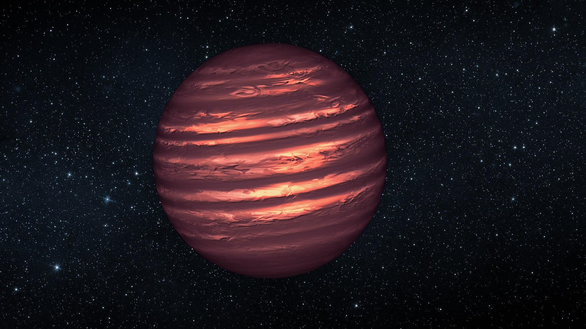

# The Beginning

## Formation of the Protostar

{ align=right }

It all starts with a nebula (latin for "cloud"), a large cloud of dust and gas. These
nebulae dwarf the solar system, with diameters reaching up to tens of light years across.
Star formation begins in relatively small molecular clouds called dense cores which are contained within the nebula. 
They initially in balance between self-gravity, which tends to compress the object, and both gas pressure and magnetic 
pressure, which tend to inflate it. As the dense core accrues mass from its larger, surrounding cloud, self-gravity 
begins to overwhelm pressure, and collapse begins. The dense core collapses into what we call, a protostar.

## The Protostar

An accretion disk of gas and dust forms around the condensed protostar, which
becomes hotter and hotter as it contracts under its own gravity. Eventually, the protostar
becomes dense enough to become what’s called a **T-Tauri star**, characterised by strong
stellar winds that blow outward from it. It is believed that at this stage, the winds are powered
by lithium burning within, in a manner similar to the PP-chain. The amount of lithium is small
compared to the amount of hydrogen however, and after 100 million years the lithium will get
exhausted. Gravitational collapse continues.

The length of time all of this takes depends on the mass of the star. The more massive the star, the faster everything 
happens. Collapse into a star like our Sun takes about 50 million years. The collapse of a very high mass protostar 
might take only a million years. Smaller stars can take more than a hundred million years to form.

!!! note
    This accretion disk of gas and dust around the protostar is known as the protoplatenary disk and it is here
    that planets form. This will be further elaborated on when we go through the formation of the solar system.

## Transformation into a Star

Soon enough, the centre of the star becomes hot and dense enough to start nuclear
fusion, and the star stops collapsing once the radiation reaches the surface and halts the
gravitational collapse. A star’s life is all about a battle between the radiation pressure from
within and gravitational collapse of the star itself. The star’s entrance into the main sequence
marks the start of nuclear fusion halting the gravitational collapse of the star, producing a
stable hydrostatic equilibrium. If the star collapses more, its density increases, and the
radiation pressure becomes stronger, causing it to expand. If there is too much radiation
pressure, the star expands outwards and becomes less dense, reducing the rate of nuclear
fusion and thus radiation pressure.

<figure markdown>
  { width="300",align=right }
  <figcaption>An Artist Impression of a brown dwarf.</figcaption>
</figure>

However, in certain cases, the star may fail to become a fully-fledged star and may instead become a brown dwarf or 
a failed star. While they are not capable of fusing hydrogen, some are able to fuse deuterium and some more massive 
ones can fuse lithium. Brown dwarfs can resemble planets with their masses ranging from 13 - 80 times the mass of Jupiter.
